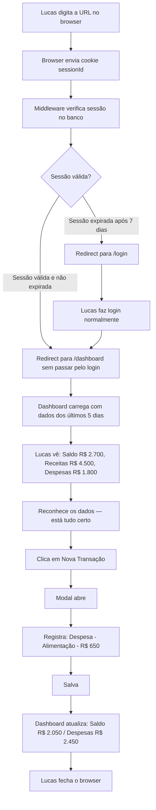

# UX Design Specification MeuDinheiro

**Author:** Davidson
**Date:** 2026-02-26

---

## Executive Summary

### Project Vision

MeuDinheiro existe para eliminar a lacuna entre a intenção de controlar as finanças e o hábito real de fazê-lo. A visão de UX é construir uma experiência de beleza funcional: cada pixel, cada animação e cada decisão de fluxo serve ao objetivo de dar ao usuário clareza financeira instantânea com zero fricção no registro.

O produto não compete com apps robustos de finanças pessoais — ele compete com a planilha que o Lucas nunca atualiza. Vencer essa competição significa ser tão rápido e tão satisfatório de usar que o hábito se forma naturalmente. A interface deve ser bonita o suficiente para o Lucas querer abrir, e eficiente o suficiente para ele nunca achar um motivo para fechar sem registrar.

Do ponto de vista visual, a logo fornecida define o DNA estético: verde vibrante (#16A34A) sinalizando positividade financeira, azul confiável (#2563EB) transmitindo solidez, e dourado (#F59E0B) como toque de destaque que remete à moeda e ao valor. A UI deve honrar esses três pilares cromáticos em todas as decisões de design.

### Target Users

**Lucas — o único usuário que importa no MVP.**

- **Perfil:** 28 anos, desenvolvedor freelancer, renda variável, pagamentos por projeto
- **Contexto financeiro:** Recebe R$ 4.000–8.000/mês em projetos, mas nunca sabe o saldo real porque as despesas chegam de forma irregular (aluguel, supermercado, Uber, assinaturas)
- **Comportamento atual:** Usa uma planilha Google que começa o mês organizada e vai deteriorando até ser abandonada na segunda semana
- **Dor central:** Não é falta de disciplina — é fricção. Abrir a planilha, encontrar a aba certa, formatar o valor, manter as categorias consistentes — isso custa mais do que o valor percebido em tempo real
- **Motivação real:** Saber exatamente o que sobrou no mês para decidir se pode pegar um projeto menor ou se precisa correr atrás de mais um cliente
- **Contexto de uso:** Desktop, durante o trabalho ou após receber um pagamento. Momentos rápidos — 30 segundos max para registrar algo e voltar ao que estava fazendo
- **Tolerância a atrito:** Muito baixa. Se demorar mais de três cliques para registrar uma transação, o Lucas vai abandonar
- **Relação com tecnologia:** Alta afinidade. Aprecia interfaces bem construídas e percebe qualidade técnica. Uma animação travada ou um layout quebrado vai diminuir a confiança no produto
- **Critério de sucesso pessoal:** "Eu sei exatamente quanto tenho disponível este mês sem precisar calcular manualmente"

### Key Design Challenges

**Desafio 1 — Velocidade sem perda de contexto**
O formulário de nova transação precisa ser rápido (poucos campos) mas completo o suficiente (tipo, valor, categoria, data, descrição) para ter utilidade real. O risco é criar um formulário tão minimalista que perde informação, ou tão completo que vira fricção. A solução UX está em defaults inteligentes (data = hoje, tipo como primeira escolha clara) e hierarquia visual que guia o olhar do campo mais importante para o menos importante.

**Desafio 2 — Feedback imediato como evidência de valor**
O dashboard precisa se atualizar visivelmente após cada transação registrada. Se o Lucas salvar uma receita e o saldo não mudar instantaneamente, ele vai duvidar se funcionou. A animação dos números não é decoração — é evidência de funcionamento. O desafio técnico (Server Actions + revalidatePath) deve se traduzir em uma experiência visual que transmite: "funcionou, aqui está a prova".

**Desafio 3 — Primeira impressão em tela zerada**
O estado inicial do dashboard — três cards mostrando R$ 0,00 e lista vazia — pode transmitir desamparo ou pode transmitir possibilidade. O desafio é criar um empty state que seja convidativo, que mostre claramente a próxima ação (registrar a primeira transação) e que não faça o produto parecer vazio ou sem valor antes de ter dados.

### Design Opportunities

**Oportunidade 1 — Animação como microinteração de reforço**
Cada vez que o Lucas registra uma transação e vê o número do card subir ou descer com uma animação spring, há um momento de satisfação. Esse momento de "funcionou!" é um reforço positivo que cria hábito. A animação dos cards não é só estética — é retenção.

**Oportunidade 2 — Semântica cromática financeira imediata**
Verde para receitas, vermelho para despesas, azul para saldo — essa convenção visual é universal e o Lucas a reconhece instantaneamente. Aplicada de forma consistente (ícones, valores, bordas dos cards, badges de categoria), cria uma linguagem visual que permite ler o dashboard sem esforço cognitivo.

**Oportunidade 3 — O modal como espaço de intenção**
O modal de nova transação, quando abre com uma animação suave, cria um momento de transição mental: o Lucas está registrando algo. A qualidade dessa animação e do design do modal define a percepção de qualidade do produto inteiro. Um modal bem projetado — limpo, com hierarquia clara, campos bem espaçados — transmite que o produto foi construído com cuidado.

---

## Core User Experience

### Defining Experience

A experiência definidora do MeuDinheiro é o momento imediatamente após salvar uma transação:

> O Lucas clica em "Salvar". O modal fecha com uma animação de saída suave. O card de Receitas no dashboard anima seu valor de R$ 0,00 para R$ 4.500,00 com um spring que parece fisicamente satisfatório. O item aparece no topo da lista de transações com uma animação de entrada. O toast aparece no canto inferior direito: "Transação registrada!" com um ícone de check verde. Levou 25 segundos desde o clique em "Nova Transação".

Esse é o momento que o produto precisa entregar perfeitamente. Tudo o mais — o onboarding, o layout, a tipografia — existe para criar as condições para esse momento acontecer.

**Tagline da experiência:** "Registre em 30 segundos. Veja o impacto na hora."

### Platform Strategy

- **Target principal:** Desktop 1280px+ — contexto de uso primário do Lucas enquanto trabalha
- **Mínimo funcional:** Tablet 768px+ — para uso ocasional em iPad
- **Mobile:** Best-effort, fora do escopo do MVP
- **Framework:** Next.js 16 App Router — Server Components para dados, Client Components para interatividade
- **Rendering strategy:** SSR para dashboard inicial (dados atualizados), CSR para interações (formulário, animações)
- **Viewport padrão de design:** 1280 x 800px (laptop HD padrão)

### Effortless Interactions

As seguintes ações devem ser completamente sem fricção — o Lucas não deve precisar pensar para executá-las:

- **Registrar uma transação:** Clique em "Nova Transação" → modal abre → preenche 4 campos → salva. Zero confirmações desnecessárias, zero redirecionamentos, zero reloads
- **Ver o saldo atual:** Visível imediatamente no primeiro card do dashboard, em tipografia grande e legível, sem scroll
- **Excluir uma transação:** Ícone de lixeira visível no hover do item → clique → toast de confirmação. Sem modal de confirmação (o undo via toast é suficiente para o MVP)
- **Fazer logout:** Botão sempre acessível no header, sem confirmação
- **Entender o que cada card representa:** Labels claros (Saldo do Mês, Receitas, Despesas), valores em formato monetário brasileiro

### Critical Success Moments

**Momento 1 — A primeira transação registrada**
O Lucas, com o dashboard zerado, clica em "Nova Transação" pela primeira vez. O modal abre. Ele preenche. Salva. O dashboard atualiza. Esse momento define se ele vai usar o produto ou não. Se funcionar perfeitamente, com animação fluida e dado correto, ele vai continuar.

**Momento 2 — O retorno após uma semana**
Lucas abre o browser, digita a URL. É redirecionado direto para o dashboard — sessão ainda ativa. Vê os dados exatamente como deixou. Esse momento prova que o produto é confiável e que ele não vai perder dados.

**Momento 3 — O saldo fazendo sentido**
Após registrar várias transações, o Lucas olha para o card de Saldo e reconhece o número. "Ah, é isso que sobra." Esse momento de clareza financeira é o valor real do produto.

### Experience Principles

**1. Contexto antes de ação**
O usuário sempre sabe onde está e o que pode fazer. O dashboard mostra os dados primeiro, o botão de nova transação é sempre visível mas não competitivo com os dados.

**2. Confirmação visual imediata**
Cada ação do usuário gera feedback visual em menos de 300ms. Nenhuma ação ocorre em silêncio.

**3. Dados preservados sempre**
Erros de validação nunca apagam o que o usuário digitou. O formulário mantém seu estado até o usuário decidir cancelar.

**4. Uma coisa de cada vez**
A interface foca em uma ação por tela. O dashboard foca em mostrar dados. O modal foca em registrar. Sem sobrecarga cognitiva.

**5. Beleza como argumento de qualidade**
A interface visualmente polida não é vaidade — é evidência de que o produto foi construído com cuidado e que os dados do usuário estão em boas mãos.

---

## Desired Emotional Response

### Primary Emotional Goals

**Clareza:** O Lucas deve olhar para o dashboard e entender sua situação financeira em menos de 5 segundos. Sem calcular, sem interpretar — só ver.

**Controle:** A capacidade de registrar e excluir transações a qualquer momento deve transmitir a sensação de que o Lucas manda nas informações, não o contrário.

**Confiança:** A interface sólida, com dados que batem, animações que não travam e sessão que persiste, deve transmitir que o produto é confiável o suficiente para guardar informações financeiras.

### Emotional Journey Mapping

**Descoberta (antes do cadastro)**
- Estado emocional: Ceticismo leve. "Mais um app de finanças?"
- O que o usuário vê: Tela de login/cadastro limpa, com a logo MeuDinheiro visível
- Meta emocional: Curiosidade. A interface limpa e profissional sugere que vale a pena tentar
- Design trigger: Tipografia Inter bold na logo, paleta de cores verde/azul que remete a finanças sem ser corporativa

**Onboarding (cadastro)**
- Estado emocional: Esperançoso, mas impaciente
- O que o usuário vê: Formulário de cadastro com 3 campos (nome, email, senha), botão verde "Criar conta"
- Meta emocional: Satisfação por ser rápido. "Isso foi fácil"
- Design trigger: Formulário de uma coluna, campos bem espaçados, sem campos desnecessários, botão CTA verde #16A34A

**Primeiro contato com o dashboard (tela zerada)**
- Estado emocional: Incerteza. "O que faço agora?"
- O que o usuário vê: 3 cards zerados, lista vazia, botão "Nova Transação" em destaque
- Meta emocional: Orientação. O empty state guia para a próxima ação sem desanimar
- Design trigger: Empty state com ícone ilustrativo, texto encorajador, botão CTA proeminente

**Primeiro registro**
- Estado emocional: Foco, levemente ansioso para ver o resultado
- O que o usuário vê: Modal de nova transação, formulário claro
- Meta emocional: Eficiência. "Isso foi mais rápido do que esperava"
- Design trigger: Modal com animação de entrada, campos com labels claros, validação inline sem ruído

**Pós-registro (ver o dashboard atualizar)**
- Estado emocional: Satisfação, talvez surpresa positiva
- O que o usuário vê: Modal fecha, cards animam, item aparece na lista, toast de sucesso
- Meta emocional: Encantamento. "Uau, funcionou na hora"
- Design trigger: Spring animation nos números, AnimatePresence na lista, toast Sonner com ícone verde

**Retorno após dias**
- Estado emocional: Confiante
- O que o usuário vê: Dashboard com dados preservados, sessão ativa
- Meta emocional: Tranquilidade. "Está tudo aqui, como eu deixei"
- Design trigger: Redirecionamento direto para dashboard, dados carregados imediatamente

### Micro-Emotions

- **Confiança:** Transmitida pela solidez visual dos cards, tipografia legível, dados formatados corretamente em BRL
- **Satisfação:** Gerada pela animação dos números ao registrar, pelo feedback imediato do toast Sonner
- **Encantamento:** O momento da spring animation nos cards — inesperado mas agradável
- **Tranquilidade:** Sessão persistente, dados sempre ali quando o Lucas voltar
- **Competência:** A interface que não tem bugs visíveis, não trava, não falha — transmite que o Lucas fez a escolha certa

### Design Implications

| Emoção | Implicação de Design Concreta |
|---|---|
| Clareza | Cards com tipografia Inter 800 em 2rem para valores, hierarquia visual forte, verde/vermelho/azul semânticos |
| Controle | Botão de excluir sempre acessível (hover do item), ações reversíveis comunicadas pelo toast |
| Confiança | Sombras sutis nos cards (não flat demais), bordas arredondadas consistentes (radius 12px), sem erros visíveis |
| Satisfação | useSpring do Framer Motion nos números, AnimatePresence na lista, toast com duração adequada (3s) |
| Encantamento | Spring animation com overshoot leve nos cards, entrada dos itens com slide+fade |
| Tranquilidade | Estado de loading com skeleton (não flash de conteúdo), dados sempre corretos após hydration |

### Emotional Design Principles

- **Nunca deixar o usuário sem feedback:** Toda ação tem resposta visual em menos de 300ms
- **Animação com propósito:** Cada animação comunica uma mudança de estado, não é decoração
- **Erros como orientação, não punição:** Mensagens de erro dizem o que corrigir, não apenas que está errado
- **Silêncio visual quando não há ação:** Interface tranquila quando não está processando — sem spinners desnecessários, sem estados de loading artificiais

---

## UX Pattern Analysis & Inspiration

### Inspiring Products Analysis

**Linear (linear.app) — Clareza e Velocidade**
O Linear é a referência de app moderno de produtividade que parece rápido mesmo quando está fazendo muito. Os elementos-chave que inspiram o MeuDinheiro:
- Layout sem sidebar no estado padrão — conteúdo ocupa toda a largura
- Tipografia compacta mas legível — densidade informacional alta sem sensação de congestionamento
- Keyboard shortcuts para ações rápidas (inspiração para o MVP: Enter para submeter o formulário)
- Feedback optimista — a ação acontece na UI antes da confirmação do servidor
- Palette monocromática com um acento de cor — sem competição visual

**Vercel Dashboard (vercel.com/dashboard) — Dados em Cards Limpos**
O dashboard da Vercel mostra métricas em cards que são a referência direta para o design dos 3 cards do MeuDinheiro:
- Cards com fundo branco, sombra leve (box-shadow 0 1px 3px rgba(0,0,0,0.1))
- Label em texto cinza pequeno acima do valor principal em tipografia bold grande
- Ícone decorativo no canto superior direito do card (não funcional, mas âncora visual)
- Valor principal com hierarquia clara — é a primeira coisa que o olho encontra
- Grid de 3 colunas em desktop, responsivo para 1 coluna em mobile

**Stripe Dashboard (dashboard.stripe.com) — Formulários sem Fricção**
O Stripe é a referência de formulário que qualquer dev conhece e confia:
- Labels sempre visíveis (não placeholder-only)
- Validação onBlur — não pune o usuário enquanto ainda está digitando
- Mensagem de erro específica abaixo do campo, em vermelho discreto
- Botão de submit desabilita durante o request, com loading state
- Campos agrupados logicamente com espaçamento generoso
- Select com ícone de chevron customizado, não o select nativo feio

### Transferable UX Patterns

**Do Linear:**
- Submit via Enter no formulário (sem precisar clique no botão)
- ESC para fechar modal sem confirmação
- Feedback optimista no estado local enquanto aguarda confirmação do servidor (MVP: via revalidatePath)
- Tipografia de interface em Inter, não em serif

**Do Vercel Dashboard:**
- Grid de 3 cards em linha no topo do dashboard
- Card anatomy: icon + label (12px) + valor (24px bold) + variação opcional
- Box shadow como separador de plano, não border
- Background de página em cinza muito claro (#F8FAFC), cards em branco (#FFFFFF)
- Espaçamento entre cards: 16px (gap)

**Do Stripe:**
- Sempre label + input, nunca placeholder como label
- Validação onBlur para campos visitados, imediata para campos em foco com erro
- Erro inline abaixo do campo, em vermelho (#DC2626), em fonte 12px
- Select customizado (shadcn/ui Select) — nunca o select nativo do browser
- Botão de submit com loading state explícito (texto muda + spinner opcional)

### Anti-Patterns to Avoid

- **Modal com confirmação para exclusão:** "Tem certeza que quer excluir?" é fricção desnecessária. Usar toast com undo (ou apenas toast informativo) é mais eficiente
- **Placeholder como label:** Quando o usuário começa a digitar, o placeholder some e ele não sabe mais o que o campo pede
- **Validação agressiva no onChange desde o início:** Marcar o campo como erro antes do usuário terminar de digitar é irritante. Validar onBlur nos campos virgens
- **Loading state longo sem skeleton:** Flash de conteúdo (tela em branco → dados) é visualmente agressivo. Skeleton carrega progressivamente
- **Toast que dura 1 segundo:** O usuário não consegue ler. Duração mínima de 3 segundos
- **Formulário com muitos campos obrigatórios:** Cada campo adicional é um argumento para não registrar. O MVP tem apenas os essenciais
- **Cores vibrantes em excesso:** Usar verde, azul e vermelho em tudo cria poluição visual. Acentos com propósito, neutros como base
- **Animações longas:** Transições acima de 400ms parecem lentas. O sweet spot é 200–300ms para a maioria das animações de UI

### Design Inspiration Strategy

**Adotar diretamente:**
- Sistema de 3 cards do Vercel (anatomy, spacing, shadow)
- Formulário com labels do Stripe (sempre visíveis, validação inteligente)
- Tipografia de interface em Inter de todas as três referências

**Adaptar com personalidade própria:**
- Cores do Linear (monocromático + acento) — adaptar para a paleta verde/azul da logo do MeuDinheiro
- Cards do Vercel — adicionar semântica de cor (verde para receitas, vermelho para despesas, azul para saldo)
- Submit do Stripe — adicionar spring animation no update dos valores (o Stripe não tem animação nos números)

**Evitar ativamente:**
- Complexidade do Linear (filtros avançados, views customizadas) — o MVP é radicalmente simples
- Densidade de dados do Stripe Dashboard — o MeuDinheiro é mais simples e mais caloroso
- Sidebar navigation de qualquer referência — o MVP não tem navegação suficiente para justificar sidebar

---

## Design System Foundation

### Design System Choice

**shadcn/ui + Tailwind CSS** é a fundação do design system do MeuDinheiro.

shadcn/ui não é uma biblioteca de componentes no sentido tradicional — é uma coleção de componentes que vivem no código do projeto, completamente customizáveis. Os componentes são gerados em `src/components/ui/` e podem ser modificados diretamente, sem necessidade de overrides complexos.

Tailwind CSS fornece a camada de utilitários que elimina a necessidade de CSS customizado para a maioria dos casos. A integração entre shadcn/ui e Tailwind é nativa — todos os componentes do shadcn/ui usam classes Tailwind.

**Componentes shadcn/ui utilizados no MVP:**
- `Button` — ações primárias e secundárias
- `Card`, `CardHeader`, `CardContent`, `CardTitle` — cards do dashboard
- `Dialog`, `DialogContent`, `DialogHeader`, `DialogTitle` — modal de nova transação
- `Form`, `FormField`, `FormItem`, `FormLabel`, `FormControl`, `FormMessage` — formulário com react-hook-form
- `Input` — campos de texto e número
- `Label` — labels de formulário standalone
- `Select`, `SelectContent`, `SelectItem`, `SelectTrigger`, `SelectValue` — seletores de tipo e categoria
- `Skeleton` — loading states
- `Sonner` (Toaster) — toast notifications

### Rationale for Selection

**Por que shadcn/ui é ideal para este projeto:**

1. **Acessibilidade by default:** Todos os componentes são baseados em Radix UI, que implementa ARIA corretamente. WCAG AA é atendido sem esforço adicional
2. **Customização sem limitação:** As cores da logo do MeuDinheiro (#16A34A, #2563EB) são aplicadas via CSS variables sem hacks ou overrides frágeis
3. **Consistência visual automática:** Border radius, shadows e espaçamentos são definidos em um lugar (CSS variables) e propagados para todos os componentes
4. **Integração com react-hook-form:** O componente `Form` do shadcn/ui foi projetado especificamente para uso com react-hook-form + Zod
5. **Zero dependência de versão:** Os componentes são copiados para o projeto — não há risco de breaking change por atualização da biblioteca
6. **Performance:** Sem CSS-in-JS, sem runtime overhead. Tailwind gera CSS estático em build time

### Implementation Approach

**Fase 1 — Setup:**
```bash
npx shadcn@latest init
# Escolher: Default style, cinza como base color, CSS variables = sim
```

**Fase 2 — Instalar componentes necessários:**
```bash
npx shadcn@latest add button card dialog form input label select skeleton sonner
```

**Fase 3 — Customizar CSS variables em `globals.css`:**
As variáveis HSL do shadcn/ui são sobrescritas para refletir a paleta da logo.

**Fase 4 — Criar componentes da aplicação:**
Componentes em `src/components/dashboard/`, `src/components/transactions/`, `src/components/auth/` usando os componentes shadcn/ui como base.

### Customization Strategy

**CSS Variables em `src/app/globals.css`:**

```css
:root {
  /* Primary — verde da logo "Meu" */
  --primary: 142 72% 36%;          /* #16A34A em HSL */
  --primary-foreground: 0 0% 100%;

  /* Accent — dourado da moeda */
  --accent: 38 93% 51%;            /* #F59E0B em HSL */
  --accent-foreground: 0 0% 10%;

  /* Destructive — vermelho para despesas/erros */
  --destructive: 0 84% 60%;        /* #DC2626 em HSL */
  --destructive-foreground: 0 0% 100%;

  /* Background — cinza muito claro */
  --background: 210 40% 98%;       /* #F8FAFC em HSL */
  --card: 0 0% 100%;               /* Branco puro para cards */

  /* Border radius global */
  --radius: 0.75rem;               /* 12px — arredondado mas não excessivo */
}
```

**Tokens semânticos financeiros (Tailwind config):**
```javascript
// tailwind.config.ts — extend colors
colors: {
  income: {
    DEFAULT: '#16A34A',
    light: '#DCFCE7',
    dark: '#14532D',
  },
  expense: {
    DEFAULT: '#DC2626',
    light: '#FEE2E2',
    dark: '#7F1D1D',
  },
  balance: {
    DEFAULT: '#2563EB',
    light: '#DBEAFE',
    dark: '#1E3A8A',
  },
  gold: {
    DEFAULT: '#F59E0B',
    light: '#FDE68A',
  }
}
```

---

## 2. Core User Experience

### 2.1 Defining Experience

**MeuDinheiro em uma frase:** "Ver seu saldo real em segundos, registrar uma transação sem esforço."

A experiência core não está em nenhuma feature específica — está na composição de três elementos que funcionam em conjunto:

1. **Velocidade de percepção:** O dashboard carrega com dados reais sem loading perceptível (Server Component com dados do Prisma)
2. **Velocidade de ação:** Do clique em "Nova Transação" ao dado no dashboard em menos de 30 segundos
3. **Feedback instantâneo:** Animação spring nos cards, entrada animada na lista, toast Sonner — três camadas de confirmação simultâneas

### 2.2 User Mental Model

**Como o Lucas pensa sobre finanças pessoais:**

O Lucas não pensa em "lançamentos contábeis" — ele pensa em "o que entrou e o que saiu esse mês". O modelo mental dele é simples: tem um bolo de dinheiro (receitas) e vai saindo pedaços (despesas). O que sobra é o que pode gastar.

**Comparação com planilha:**
Na planilha, o Lucas precisa: abrir o Google Sheets → navegar até a aba certa → scrollar até a linha vazia → digitar o valor → formatar como moeda → escrever a categoria manualmente (inconsistente) → calcular o saldo (fórmula pode estar quebrada).

No MeuDinheiro: clica em "Nova Transação" → digita o valor → seleciona categoria → salva → vê o saldo atualizar.

O MeuDinheiro mapeia para o modelo mental do Lucas: é o mesmo bolo/pedaços, mas sem a fricção da planilha.

**Convenções que o Lucas já conhece:**
- Verde = dinheiro entrando
- Vermelho = dinheiro saindo
- R$ como prefixo de valores monetários
- Formato de data DD/MM/AAAA
- Vírgula como separador decimal (o formulário deve aceitar e converter)

### 2.3 Success Criteria

**Critérios concretos de sucesso da experiência core:**

| Critério | Métrica | Target |
|---|---|---|
| Velocidade de registro | Tempo do clique em "Nova Transação" até toast de sucesso | Menos de 30 segundos |
| Clareza do dashboard | Tempo para o usuário identificar o saldo atual | Menos de 3 segundos |
| Taxa de completude do formulário | Percentual de formulários abertos que são submetidos com sucesso | Acima de 90% |
| Feedback de ação | Tempo entre submit e feedback visual visível | Menos de 300ms |
| Retenção de dados em erro | Percentual das vezes que dados do formulário são preservados em erro de validação | 100% |
| Sessão persistente | Usuário é redirecionado para dashboard (não login) após 7 dias sem acesso | 100% |

### 2.4 Novel UX Patterns

**Padrões estabelecidos (não reinventar):**
- Modal para formulário de criação (Dialog do shadcn/ui)
- Toast para feedback de ações (Sonner)
- Cards para métricas de dashboard
- Lista vertical para histórico de transações
- Formulário com labels e validação inline

**Inovações específicas do MeuDinheiro:**
- **Spring animation nos valores dos cards:** Quando o valor de um card muda, o número anima usando useSpring do Framer Motion — não é um simples fade, é uma animação física que dá peso ao valor
- **Filtragem dinâmica de categorias:** Quando o usuário muda o tipo (Receita/Despesa), as opções de categoria do Select mudam imediatamente, sem nenhum estado de loading
- **Semântica cromática total:** A cor verde/vermelho não aparece apenas no valor — aparece no ícone do card, na borda esquerda do item da lista, e no badge de categoria. Consistência semântica em todos os nós visuais

### 2.5 Experience Mechanics

**Ação: Registrar Nova Transação**

| Fase | O que acontece | Detalhe técnico | Feedback visual |
|---|---|---|---|
| Initiation | Usuário clica em "Nova Transação" | Estado do modal muda para open | Dialog abre com animation: scale 0.95→1 + opacity 0→1, duration 200ms |
| Interaction (Tipo) | Usuário seleciona Receita ou Despesa | Estado local do formulário atualiza | Select de categoria filtra opções instantaneamente |
| Interaction (Valor) | Usuário digita o valor | onChange sem validação agressiva | Label permanece visível acima do campo |
| Interaction (Categoria) | Usuário seleciona categoria | Select filtra por tipo selecionado | Opções corretas aparecem |
| Interaction (Data) | Data já preenchida com hoje | Default = today, usuário pode alterar | Input type date com valor padrão |
| Interaction (Descrição) | Campo opcional | Pode ser deixado em branco | Label indica "(opcional)" |
| Feedback (Erro) | Usuário tenta submit com campo inválido | zodResolver marca erro | Mensagem vermelha abaixo do campo, campo com borda vermelha |
| Completion (Submit) | Todos os campos válidos, botão clicado | Server Action chamada, botão disabled | Botão mostra "Salvando..." |
| Completion (Success) | Server Action retorna success | revalidatePath('/dashboard'), toast | Modal fecha, cards animam, item aparece na lista, toast "Transação registrada!" |

**Ação: Excluir Transação**

| Fase | O que acontece | Detalhe técnico | Feedback visual |
|---|---|---|---|
| Initiation | Usuário passa mouse sobre item da lista | Estado de hover | Ícone de lixeira aparece (opacity 0→1) |
| Interaction | Usuário clica no ícone de lixeira | Estado de loading local | Ícone de lixeira vira spinner |
| Completion | Server Action retorna success | revalidatePath, item some da lista | AnimatePresence remove item com exit animation, toast "Transação excluída", cards atualizam |

---

## Visual Design Foundation

### Color System

**Paleta primária extraída da logo:**

| Token | Hex | HSL | Uso |
|---|---|---|---|
| `--green-primary` | `#16A34A` | 142 72% 36% | CTA principal, ícones de receita, saldo positivo, botão "Salvar" |
| `--blue-secondary` | `#2563EB` | 217 91% 60% | Card de saldo, links, informações secundárias |
| `--teal-wallet` | `#0F766E` | 176 77% 26% | Detalhes do header, acento alternativo |
| `--green-light` | `#34D399` | 152 73% 60% | Background de badges de receita |
| `--green-mid` | `#059669` | 160 84% 39% | Hover de botão verde |
| `--blue-bar` | `#60A5FA` | 213 97% 68% | Badges informativos, bordas de saldo |
| `--blue-dark` | `#1D4ED8` | 224 89% 48% | Hover de azul |
| `--gold` | `#F59E0B` | 38 93% 51% | Highlights especiais, ícone da moeda |
| `--gold-light` | `#FDE68A` | 49 97% 77% | Background de destaque dourado |
| `--gray-text` | `#6B7280` | 220 9% 46% | Texto secundário, labels, captions |

**Paleta semântica financeira:**

| Contexto | Background | Texto | Borda/Icone |
|---|---|---|---|
| Receita | `#DCFCE7` | `#14532D` | `#16A34A` |
| Despesa | `#FEE2E2` | `#7F1D1D` | `#DC2626` |
| Saldo positivo | `#DBEAFE` | `#1E3A8A` | `#2563EB` |
| Saldo negativo | `#FEE2E2` | `#7F1D1D` | `#DC2626` |

**Paleta neutra de UI:**

| Token | Hex | Uso |
|---|---|---|
| `--bg-page` | `#F8FAFC` | Background da página |
| `--bg-card` | `#FFFFFF` | Background dos cards |
| `--border` | `#E2E8F0` | Bordas de separação |
| `--text-primary` | `#0F172A` | Texto principal |
| `--text-secondary` | `#6B7280` | Labels, datas, metadados |
| `--text-muted` | `#94A3B8` | Placeholders, texto desabilitado |

### Typography System

**Fonte:** Inter (Google Fonts) — já presente na logo, reconhecível pelo Lucas como fonte de produto moderno.

```css
/* Import no layout.tsx */
import { Inter } from 'next/font/google'
const inter = Inter({ subsets: ['latin'] })
```

**Escala tipográfica:**

| Nível | Uso | Size | Weight | Line Height | Exemplo |
|---|---|---|---|---|---|
| Display | Valores nos cards do dashboard | 2rem (32px) | 800 | 1 | R$ 4.500,00 |
| Heading 1 | Título da página | 1.5rem (24px) | 700 | 1.25 | Dashboard |
| Heading 2 | Títulos de seção | 1.25rem (20px) | 600 | 1.35 | Últimas Transações |
| Heading 3 | Labels de card | 0.875rem (14px) | 500 | 1.4 | SALDO DO MÊS |
| Body | Conteúdo principal | 1rem (16px) | 400 | 1.5 | Descrições, texto geral |
| Body Strong | Valores na lista | 1rem (16px) | 600 | 1.5 | R$ 650,00 |
| Caption | Datas, categorias | 0.875rem (14px) | 400 | 1.4 | 26/02/2026 · Alimentação |
| Label | Labels de formulário | 0.875rem (14px) | 500 | 1.4 | Valor |
| Error | Mensagens de erro | 0.75rem (12px) | 400 | 1.4 | Campo obrigatório |

**Valores monetários:** Sempre em Inter 800 (Display) nos cards, Inter 600 nos itens da lista. Prefixo "R$" em font-weight 400, valor numérico em bold — contraste intencional para o olho pular direto para o número.

### Spacing & Layout Foundation

**Base unit:** 4px

**Escala de espaçamento:**
- `space-1`: 4px — gap entre ícone e texto
- `space-2`: 8px — padding interno de badges
- `space-3`: 12px — gap entre elementos de formulário próximos
- `space-4`: 16px — gap padrão entre cards, padding de itens de lista
- `space-6`: 24px — padding interno de cards, gap entre seções próximas
- `space-8`: 32px — gap entre seções principais
- `space-12`: 48px — padding de container em desktop
- `space-16`: 64px — separação de blocos maiores

**Layout do dashboard (1280px):**
```
+-----------------------------------------------------+
| Header (64px height, px-12)                         |
| [Logo]                              [Ola, Lucas] [Sair] |
+-----------------------------------------------------+
| Main content (px-12, py-8)                          |
| +---------------+---------------+---------------+   |
| | Card Saldo    | Card Receitas | Card Despesas |   |
| | (flex-1)      | (flex-1)      | (flex-1)      |   |
| +---------------+---------------+---------------+   |
| gap-4 entre cards                                   |
|                                                     |
| +-------------------------------------------------+ |
| | Ultimas Transacoes (mt-8)   [+ Nova Transacao]  | |
| | +---------------------------------------------+ | |
| | | TransactionItem (py-4, px-4)                | | |
| | | TransactionItem                             | | |
| | | TransactionItem                             | | |
| | +---------------------------------------------+ | |
| +-------------------------------------------------+ |
+-----------------------------------------------------+
```

**Espaçamento interno dos cards:**
```
Card: p-6 (24px)
  Header: pb-2
    Icon: h-5 w-5, mr-2
    Label: text-sm font-medium text-muted-foreground
  Content: pt-0
    Valor: text-3xl font-extrabold
```

### Accessibility Considerations

**Contraste (WCAG AA obrigatório):**
- Texto primário `#0F172A` em background `#FFFFFF`: ratio 19.6:1 (AAA)
- Texto secundário `#6B7280` em background `#FFFFFF`: ratio 4.6:1 (AA)
- Texto verde `#14532D` em background `#DCFCE7`: ratio 7.2:1 (AAA)
- Texto vermelho `#7F1D1D` em background `#FEE2E2`: ratio 8.1:1 (AAA)
- Botão primário: texto branco `#FFFFFF` em `#16A34A`: ratio 3.4:1 (AA para texto grande, 18px bold)

**Foco visível:**
- Todos os elementos interativos têm `focus-visible:ring-2 focus-visible:ring-green-primary focus-visible:ring-offset-2`
- Shadcn/ui implementa focus ring por padrão — verificar que não é removido com `outline-none` sem substituto

**Semântica e ARIA:**
- `aria-live="polite"` no contêiner de toast (Sonner implementa nativamente)
- `aria-describedby` ligando campos de formulário às suas mensagens de erro
- `role="status"` em elementos de loading
- `aria-label` em botões de ícone (botão de excluir: `aria-label="Excluir transação"`)
- Heading hierarchy: `h1` para o título da página, `h2` para seções, nunca pular níveis

**Framer Motion e acessibilidade:**
```typescript
// Respeitar prefers-reduced-motion
const prefersReducedMotion = useReducedMotion()
const variants = {
  initial: prefersReducedMotion ? {} : { opacity: 0, y: 20 },
  animate: { opacity: 1, y: 0 },
}
```

---

## Design Direction Decision

### Design Directions Explored

**Direcao A — Clean Minimal Financial (ESCOLHIDA)**
Fundo `#F8FAFC` (cinza muito claro), cards brancos com sombra leve, tipografia Inter compacta e bold para números, acentos verde/azul da logo. Inspirado em Vercel + Linear. Transmite profissionalismo moderno.

**Direcao B — Dark Mode Financial**
Fundo `#0F172A`, cards `#1E293B`, texto branco, acentos verdes neon e azuis brilhantes. Visual de "terminal financeiro". Alto impacto visual mas pode parecer frio para um app de finanças pessoais. Riscos de contraste com as cores da logo.

**Direcao C — Warm Personal**
Fundo `#FFFBF0` (amarelo muito claro), tons quentes, tipografia com mais arredondamento. Mais casual, menos corporativo. Pode remeter a apps de diário ou de bem-estar mais do que a finanças. Conflito com a logo verde/azul.

**Direcao D — Professional Corporate**
Azul marinho como primário, linhas retas, muito sério. Parece banco, não app pessoal. Não reflete o perfil do Lucas.

**Direcao E — Colorful Dashboard**
Múltiplos acentos de cor, gráficos coloridos, visual festivo. Poluição visual para um MVP sem gráficos. Distrai do conteúdo.

**Direcao F — Modern Glassmorphism**
Cards com blur, gradientes translúcidos, aesthetic pesado. Performance ruim em animações, difícil de manter contraste WCAG. Trendy mas não funcional.

### Chosen Direction

**Direção A — Clean Minimal Financial**

Esta é a direção escolhida e recomendada para implementação.

**Características visuais:**
- Background da página: `#F8FAFC` — cinza quase branco que cria profundidade sem escurecer
- Cards: `#FFFFFF` com `box-shadow: 0 1px 3px rgba(0,0,0,0.1), 0 1px 2px rgba(0,0,0,0.06)` — sombra sutil mas definitiva
- Border radius: `12px` para cards, `8px` para botões e inputs, `6px` para badges
- Tipografia: Inter em todas as variações, bold extremo apenas para valores financeiros
- Acentos: Verde `#16A34A` como primário, Azul `#2563EB` como secundário, usados cirurgicamente
- Background de acentos: Light green `#DCFCE7` para receitas, Light red `#FEE2E2` para despesas — nunca cor sólida vibrante no fundo

### Design Rationale

**Por que Clean Minimal funciona melhor:**

1. **Para o contexto de demo ao vivo:** A direção minimalista é mais fácil de implementar sem bugs visuais. Dark mode requer atenção extra a cada componente. Glassmorphism tem problemas de performance.

2. **Para o usuário Lucas:** Dev de 28 anos está acostumado com interfaces como Linear, Vercel, GitHub — todas clean minimal. É o idioma visual que ele reconhece como "produto de qualidade".

3. **Para a identidade da logo:** A logo usa verde e azul em fundo claro. A Direção A preserva esse contexto, fazendo a logo parecer que pertence à interface. Dark mode criaria dissonância.

4. **Para acessibilidade:** Contraste é mais fácil de garantir em fundo claro. As cores semânticas (verde receita, vermelho despesa) funcionam melhor em fundos claros.

5. **Para animações:** Framer Motion em fundo branco/cinza claro produz animações mais limpas. Sombras e efeitos de elevação ficam mais naturais.

### Implementation Approach

**Backgrounds:**
```css
body: bg-slate-50        /* #F8FAFC */
card: bg-white           /* #FFFFFF */
modal overlay: bg-black/50
header: bg-white border-b border-slate-200
```

**Shadows (aplicados via Tailwind):**
```css
card: shadow-sm          /* 0 1px 2px rgba(0,0,0,0.05) */
card hover: shadow-md    /* 0 4px 6px rgba(0,0,0,0.07) */
modal: shadow-xl         /* elevacao maxima */
```

**Color application por contexto:**
```
Botão primário: bg-green-600 text-white hover:bg-green-700
Botão secundário: border border-slate-200 bg-white text-slate-700 hover:bg-slate-50
Botão destrutivo: bg-red-600 text-white hover:bg-red-700
Card saldo: icon text-blue-600, valor text-slate-900
Card receitas: icon text-green-600, valor text-slate-900
Card despesas: icon text-red-600, valor text-slate-900
Badge receita: bg-green-100 text-green-800
Badge despesa: bg-red-100 text-red-800
```

---

## User Journey Flows

### Jornada 1 — Onboarding e Primeiro Registro (Happy Path)

Lucas descobre o MeuDinheiro na live do Davidson. Abre a URL. Acabou de receber R$ 4.500 de um projeto freelance e quer registrar antes de esquecer.

**Contexto:** Primeira visita, sem sessão, intent claro de registrar uma transação.

```mermaid
flowchart TD
    A[Lucas acessa MeuDinheiro] --> B{Tem sessão ativa?}
    B -->|Não| C[Redirecionado para /login]
    B -->|Sim| G
    C --> D[Vê tela de login limpa com logo]
    D --> E[Clica em 'Criar conta' link]
    E --> F[/register — formulário de cadastro]
    F --> FA[Preenche Nome: Lucas]
    FA --> FB[Preenche Email: lucas@freelancer.com]
    FB --> FC[Preenche Senha]
    FC --> FD{Validação OK?}
    FD -->|Erro email inválido| FE[Erro inline abaixo do campo]
    FE --> FB
    FD -->|OK| G[Redirecionado para /dashboard]
    G --> H[Dashboard carrega com 3 cards zerados]
    H --> I[Empty state na lista: 'Nenhuma transação ainda']
    I --> J[Lucas vê botão 'Nova Transação' em destaque]
    J --> K[Clica em 'Nova Transação']
    K --> L[Dialog abre com animação scale+fade 200ms]
    L --> M[Seleciona tipo: Receita]
    M --> N[Select de categoria filtra para: Salário, Freelance, Outros]
    N --> O[Digita valor: 4500]
    O --> P[Seleciona categoria: Freelance]
    P --> Q[Data já preenchida com hoje: 26/02/2026]
    Q --> R[Descrição: 'Projeto Website XYZ' - opcional]
    R --> S[Clica em 'Salvar transação']
    S --> T{Validação final OK?}
    T -->|OK| U[Server Action createTransaction chamada]
    U --> V[Botão muda para 'Salvando...' disabled]
    V --> W[Server Action retorna success]
    W --> X[revalidatePath /dashboard]
    X --> Y[Dialog fecha com animação de saída]
    Y --> Z[Card Receitas anima: R$ 0 para R$ 4.500,00]
    Z --> AA[Card Saldo anima: R$ 0 para R$ 4.500,00]
    AA --> AB[Transação aparece no topo da lista com slide animation]
    AB --> AC[Toast Sonner: Transação registrada!]
    AC --> AD[Lucas vê claramente: Receita R$ 4.500 / Saldo R$ 4.500]
```

**Pontos de deleite nesta jornada:**
- Cadastro sem perguntas desnecessárias — 3 campos apenas
- Dashboard com empty state convidativo, não desolador
- Modal com animação de entrada que sinaliza "modo de registro"
- Filtragem automática de categorias por tipo — parece inteligente
- Animação spring nos números — momento de satisfação após o primeiro registro

### Jornada 2 — Edge Cases e Validação

Lucas com pressa, tenta registrar rápido e comete erros.

```mermaid
flowchart TD
    A[Lucas abre 'Nova Transação'] --> B[Não seleciona tipo]
    B --> C[Vai direto para valor: digita '1.800,00' com vírgula]
    C --> D[Clica em Salvar]
    D --> E{Validação zod}
    E -->|Tipo não selecionado| F[Erro inline: 'Selecione o tipo de transação']
    F --> G[Dados preservados no formulário]
    G --> H[Lucas seleciona: Despesa]
    H --> I[Categorias filtram: Alimentação, Transporte, Moradia...]
    I --> J[Valor com vírgula é inválido como Float]
    J --> K[Erro inline: 'Use apenas números e ponto decimal']
    K --> L[Lucas corrige para '1800']
    L --> M[Seleciona Categoria: Moradia]
    M --> N[Clica em Salvar]
    N --> O{Validação OK}
    O -->|OK| P[Server Action chamada]
    P --> Q[Sucesso]
    Q --> R[Cards atualizam: Despesas R$ 1.800 / Saldo R$ 2.700]
    R --> S[Toast: Transação registrada!]
    S --> T[Lucas quer excluir uma transação errada]
    T --> U[Passa mouse sobre item na lista]
    U --> V[Ícone de lixeira aparece à direita]
    V --> W[Clica no ícone]
    W --> X[Ícone vira spinner]
    X --> Y[Server Action deleteTransaction]
    Y --> Z[Item some da lista com exit animation]
    Z --> AA[Cards atualizam automaticamente]
    AA --> AB[Toast: Transação excluída]
```



**Decisões de UX para edge cases:**
- Valor com vírgula: erro específico, não genérico ("Use ponto decimal" — instrução direta)
- Formulário preserva TODOS os dados após erro — o Lucas não recomeça do zero
- Sem modal de confirmação para excluir — o toast é a confirmação pós-ação
- Botão desabilitado durante submissão — previne duplo-clique acidental

### Jornada 3 — Retorno do Usuário (Sessão Persistente)

Lucas não abre o MeuDinheiro há 5 dias. Volta para registrar uma despesa.



**Por que esta jornada importa:**
O retorno silencioso — sem pedir login desnecessariamente — é o que distingue um app que o Lucas usa de um app que ele abandona. A sessão de 7 dias com cookie httpOnly é a fundação técnica deste momento de UX.

### Journey Patterns

**Padrão 1 — "Abrir → Registrar → Fechar"**
A jornada dominante do usuário recorrente. Deve ser executável em menos de 45 segundos total, incluindo o tempo de carregamento inicial. O botão "Nova Transação" deve estar sempre visível sem scroll.

**Padrão 2 — "Revisar → Corrigir"**
O usuário registrou algo errado. Fluxo: ver na lista → excluir → registrar corretamente. Sem edição no MVP — excluir e recriar é simples o suficiente para o contexto.

**Padrão 3 — "Verificar saldo"**
O usuário abre o app só para ver quanto sobrou. Sem interação — apenas olhar o card de saldo. O dashboard carrega com dados corretos imediatamente. O usuário fecha satisfeito em menos de 5 segundos.

### Flow Optimization Principles

- **Default inteligente para data:** Hoje. O usuário não precisa alterar na maioria dos casos
- **Ordem dos campos por frequência de alteração:** Tipo (sempre altera) → Valor (sempre altera) → Categoria (sempre altera) → Data (raramente altera) → Descrição (opcional, último)
- **Tab order intuitivo:** Tipo → Valor → Categoria → Data → Descrição → Botão Salvar — teclado suficiente para completar sem mouse
- **Focus automático:** Quando o modal abre, o foco vai direto para o primeiro campo (tipo)
- **Enter para submeter:** `form.handleSubmit` no onKeyDown do Enter quando não há erros

---

## Component Strategy

### Design System Components

| Componente shadcn/ui | Onde é usado | Customizações |
|---|---|---|
| `Button` | CTAs, ações de formulário, logout | Variante `default` (verde via --primary), `outline`, `destructive` |
| `Card`, `CardHeader`, `CardContent`, `CardTitle` | 3 cards do dashboard, container de lista | Shadow personalizada |
| `Dialog`, `DialogContent`, `DialogHeader`, `DialogTitle`, `DialogFooter` | Modal de nova transação | Max-width 500px |
| `Form`, `FormField`, `FormItem`, `FormLabel`, `FormControl`, `FormMessage` | TransactionForm, LoginForm, RegisterForm | Mensagens de erro em pt-BR |
| `Input` | Campos de valor, email, senha, descrição | Borda vermelha via className quando há erro |
| `Label` | Labels standalone quando necessário | Nenhuma |
| `Select`, `SelectContent`, `SelectItem`, `SelectTrigger`, `SelectValue` | Tipo de transação, categoria | Filtragem dinâmica baseada em estado do formulário |
| `Skeleton` | Loading state do dashboard, loading.tsx | Shapes correspondentes aos componentes reais |
| `Sonner` (`Toaster`) | Root layout, feedback de ações | theme="light", position="bottom-right", duration=3000 |

### Custom Components

**`DashboardCards` — 3 cards reativos com animação de número**

```typescript
// src/components/dashboard/DashboardCards.tsx
// 'use client'

interface DashboardCardsProps {
  balance: number    // saldo = receitas - despesas do mês
  income: number     // total de receitas do mês
  expenses: number   // total de despesas do mês
}

// Anatomy de cada card:
// +----------------------------------+
// | [Icon]  LABEL DO CARD            |
// |                                  |
// | R$ 4.500,00                      |  <- valor com spring animation
// +----------------------------------+

// States:
// - loading: 3 Skeleton components com shapes correspondentes
// - populated: valores reais com formatação BRL
// - updating: spring animation nos valores quando props mudam

// Variants:
// - balance: ícone Wallet, azul (#2563EB) quando positivo, vermelho quando negativo
// - income: ícone TrendingUp, verde (#16A34A)
// - expenses: ícone TrendingDown, vermelho (#DC2626)

// Implementação da animação:
// useSpring do Framer Motion: de valor anterior para valor atual
// spring config: { stiffness: 100, damping: 15 }
// exibição: animated value formatado com Intl.NumberFormat
```

**`TransactionItem` — item de lista com ação de exclusão**

```typescript
// src/components/dashboard/TransactionItem.tsx
// 'use client'

interface TransactionItemProps {
  id: string
  type: 'income' | 'expense'
  category: string
  description?: string
  amount: number
  date: Date
}

// Anatomy:
// +-----------------------------------------------------+
// | [TypeIcon]  Categoria                    R$ 650,00  |
// |             Descrição (opcional)    26/02  [Trash]  |
// +-----------------------------------------------------+

// TypeIcon: ArrowUpCircle (verde) para receita, ArrowDownCircle (vermelho) para despesa
// Borda esquerda: 3px solid — verde para receita, vermelho para despesa
// Trash icon: opacity-0 default, opacity-100 no hover do item (group-hover)
// Valor: verde para receita (+R$ 4.500,00), vermelho para despesa (-R$ 650,00)

// States:
// - default: sem botão de exclusão visível
// - hover (group-hover): botão de exclusão aparece
// - deleting: ícone de lixeira vira spinner, item fica opacity-50
// - deleted: AnimatePresence anima saída (height: 0, opacity: 0)
```

**`NewTransactionModal` — modal principal do produto**

```typescript
// src/components/transactions/TransactionModal.tsx
// 'use client'

// Anatomy:
// +------------------------------------------+
// | X  Nova Transação                        |  <- DialogHeader
// +------------------------------------------+
// |  [TransactionForm]                       |  <- DialogContent
// +------------------------------------------+
// |  [Cancelar]          [Salvar transação]  |  <- DialogFooter
// +------------------------------------------+

// States:
// - closed: Dialog open=false
// - open: Dialog open=true, entrada com motion.div scale 0.95→1 + opacity 0→1
// - submitting: botão Salvar disabled, texto "Salvando..."
// - success: onSuccess callback → fecha modal, parent recebe sinal para toast
// - error: modal permanece aberto, erros inline no formulário
```

**`TransactionForm` — formulário interno do modal**

```typescript
// src/components/transactions/TransactionForm.tsx
// 'use client'

// Schema Zod (src/lib/validations/transaction.ts):
const createTransactionSchema = z.object({
  type: z.enum(['income', 'expense'], {
    required_error: 'Selecione o tipo de transação',
  }),
  amount: z.string()
    .min(1, 'Informe o valor')
    .refine(val => !isNaN(parseFloat(val)) && parseFloat(val) > 0, {
      message: 'Informe um valor positivo (use ponto como separador decimal)',
    }),
  category: z.string().min(1, 'Selecione uma categoria'),
  date: z.string().min(1, 'Selecione a data'),
  description: z.string().optional(),
})

// Ordem dos campos:
// 1. Tipo (Select): "Receita" | "Despesa" — label "Tipo"
// 2. Valor (Input type="text"): placeholder "0.00" — label "Valor (R$)"
// 3. Categoria (Select filtrado por tipo): label "Categoria"
// 4. Data (Input type="date", default hoje): label "Data"
// 5. Descrição (Input type="text", opcional): label "Descrição (opcional)"

// Validação:
// - mode: 'onBlur' para campos não tocados
// - onChange após primeiro erro (revalida ao corrigir)
// - Mensagens em pt-BR específicas por campo e por tipo de erro

// Comportamento de categoria:
// watch('type') → useEffect → setValue('category', '') quando tipo muda
// Select de categoria: options filtradas por tipo atual
```

### Component Implementation Strategy

**Camadas de abstração:**
1. `src/components/ui/` — shadcn/ui puro, não modificar
2. `src/components/[feature]/` — componentes da aplicação usando shadcn/ui como base
3. Extensões via `className` prop — Tailwind classes adicionais
4. Framer Motion wrapeando componentes existentes para animações

**Padrão de composição:**
```typescript
// Preferir composição sobre herança
// Exemplo: DashboardCard não é uma extensão de Card — usa Card internamente
function DashboardCard({ title, value, icon, variant }) {
  return (
    <Card className="shadow-sm hover:shadow-md transition-shadow">
      <CardHeader className="flex flex-row items-center justify-between pb-2">
        <CardTitle className="text-sm font-medium text-muted-foreground uppercase tracking-wide">
          {title}
        </CardTitle>
        <icon.component className={cn("h-5 w-5", variant.iconColor)} />
      </CardHeader>
      <CardContent>
        <AnimatedValue value={value} className="text-3xl font-extrabold" />
      </CardContent>
    </Card>
  )
}
```

### Implementation Roadmap

**Fase 1 — Auth Components + Layout Base (2h)**
- `LoginForm.tsx` e `RegisterForm.tsx` com react-hook-form + Zod
- `AppHeader.tsx` com logo e botão de logout
- Layout responsivo da página do dashboard (sem dados ainda)
- CSS variables customizadas para a paleta MeuDinheiro

**Fase 2 — Dashboard Data + Transaction CRUD (2h)**
- `DashboardCards.tsx` com dados reais do servidor
- `TransactionList.tsx` e `TransactionItem.tsx` com lista de transações
- `TransactionModal.tsx` e `TransactionForm.tsx` funcionais
- Server Actions `createTransaction` e `deleteTransaction`

**Fase 3 — Animações e Polish (1-2h)**
- Spring animation nos DashboardCards
- AnimatePresence na TransactionList
- Animação de entrada/saída do modal
- Toast Sonner em todas as ações
- Empty state para lista vazia
- Loading skeletons

---

## UX Consistency Patterns

### Button Hierarchy

**Primary — Verde sólido `bg-green-600`:**
- Uso: "Salvar transação" no modal, "Criar conta" no cadastro, "Entrar" no login
- Hover: `bg-green-700`
- Disabled: `opacity-50 cursor-not-allowed`
- Loading: `opacity-75 cursor-wait` + texto alterado

**Secondary — Outline neutro:**
- Uso: "Cancelar" no modal, ações de navegação
- Aparência: `border border-slate-200 bg-white text-slate-700`
- Hover: `bg-slate-50`

**Destructive — Vermelho:**
- Uso: Botão de lixeira em TransactionItem
- Aparência no MVP: icon button com `text-red-500 hover:text-red-700`

**Ghost — Para ações terciárias:**
- Uso: Logout no header
- Aparência: `text-slate-600 hover:bg-slate-100 hover:text-slate-900`
- Sem border, sem background base

### Feedback Patterns

**Toast Sonner (feedback global):**
```typescript
// Configuração no root layout:
<Toaster position="bottom-right" richColors duration={3000} />

// Uso nos componentes:
toast.success('Transação registrada!')       // verde, ícone check
toast.error('Erro ao registrar transação')   // vermelho, ícone x
toast.success('Transação excluída')          // verde (ação completada)
```

**Erros inline de formulário:**
- Exibidos abaixo do campo com `<FormMessage />` do shadcn/ui
- Cor: `text-red-600` em `text-sm`
- Aparência: sem ícone, texto direto e específico
- Borda do campo com erro: `border-red-400 focus:ring-red-400`

**Feedback visual nos cards:**
- Spring animation nos valores (Framer Motion useSpring)
- Transição: card de saldo fica brevemente verde/vermelho ao atualizar (via CSS transition)

**Estados de botão durante ação:**
```typescript
// Padrão para todos os botões de submit:
<Button type="submit" disabled={isSubmitting}>
  {isSubmitting ? 'Salvando...' : 'Salvar transação'}
</Button>
```

### Form Patterns

**Estrutura padrão de campo:**
```typescript
<FormField
  control={form.control}
  name="fieldName"
  render={({ field }) => (
    <FormItem>
      <FormLabel>Label do Campo</FormLabel>
      <FormControl>
        <Input {...field} placeholder="Placeholder descritivo" />
      </FormControl>
      <FormMessage />
    </FormItem>
  )}
/>
```

**Regras de validação:**
- Campos obrigatórios: nunca marcados com asterisco — o erro ao tentar submeter é suficiente
- Campos opcionais: label inclui "(opcional)" em texto muted
- Validação: `mode: 'onBlur'` no useForm — não validar enquanto o usuário está digitando pela primeira vez
- Após primeiro erro: `reValidateMode: 'onChange'` — valida em tempo real enquanto corrige

**Ordem dos campos no formulário de transação:**
1. Tipo (Receita/Despesa) — determina todas as outras opções
2. Valor — informação mais importante
3. Categoria — filtrada pelo tipo
4. Data — default hoje, raramente alterada
5. Descrição — opcional, último

### Navigation Patterns

**Header (AppHeader):**
```
+-----------------------------------------------------+
| [Logo MeuDinheiro SVG]      Ola, Lucas    [Sair]   |
+-----------------------------------------------------+
```
- Logo à esquerda, clicável, redireciona para `/dashboard`
- Saudação com nome do usuário (dados da sessão)
- Botão "Sair" à direita — POST para `/api/auth/logout`, Ghost variant
- Sticky no top da página: `sticky top-0 z-50 bg-white border-b border-slate-200`

**Sem sidebar no MVP:**
O MVP tem apenas uma rota autenticada (`/dashboard`). Sidebar seria sobrecarga de UI para zero benefício de navegação.

**Redirecionamentos:**
- Usuário não autenticado em rota protegida → `/login`
- Usuário autenticado em `/login` ou `/register` → `/dashboard`
- Após login/cadastro → `/dashboard`
- Após logout → `/login`

### Additional Patterns

**Loading States:**
- Carregamento inicial do dashboard: `loading.tsx` com 3 Skeleton cards + lista de 5 Skeleton items
- Carregamento do Skeleton: dimensões exatas iguais aos componentes reais para evitar layout shift
- Transição: Suspense boundary no `dashboard/page.tsx`

**Empty State:**
```
+------------------------------------------+
|                                          |
|            [Icone Wallet]                |
|                                          |
|     Nenhuma transação registrada         |
|  Registre sua primeira transação para    |
|  começar a acompanhar suas finanças      |
|                                          |
|      [+ Nova Transação]                  |
|                                          |
+------------------------------------------+
```

**AnimatePresence para lista de transações:**
```typescript
<AnimatePresence mode="popLayout">
  {transactions.map(transaction => (
    <motion.div
      key={transaction.id}
      initial={{ opacity: 0, height: 0 }}
      animate={{ opacity: 1, height: 'auto' }}
      exit={{ opacity: 0, height: 0 }}
      transition={{ duration: 0.2 }}
    >
      <TransactionItem {...transaction} />
    </motion.div>
  ))}
</AnimatePresence>
```

**Formatação de valores monetários (consistência absoluta):**
```typescript
// src/lib/utils.ts — usar SEMPRE esta função, nunca ad-hoc
export function formatCurrency(value: number): string {
  return new Intl.NumberFormat('pt-BR', {
    style: 'currency',
    currency: 'BRL',
  }).format(value)
}
// Resultado: "R$ 4.500,00"
```

**Formatação de datas:**
```typescript
export function formatDate(date: Date): string {
  return date.toLocaleDateString('pt-BR', {
    day: '2-digit',
    month: '2-digit',
    year: 'numeric',
  })
}
// Resultado: "26/02/2026"
```

---

## Responsive Design & Accessibility

### Responsive Strategy

**Desktop-first (contexto da live demo):**
O design é projetado para 1280px+ como viewport principal. Esta é a resolução de laptop HD padrão e o contexto real de uso do Lucas.

**Grid responsivo dos cards:**
```css
/* 3 colunas em desktop, 1 coluna em mobile */
.cards-grid {
  @apply grid grid-cols-1 md:grid-cols-3 gap-4;
}
```

**Modal em diferentes viewports:**
- Desktop 1280px+: modal centrado, max-width 500px
- Tablet 768px: modal com margin horizontal 24px
- Mobile menor que 768px: modal ocupa toda a largura com padding mínimo (best-effort)

**Header responsivo:**
- Desktop: logo + saudação + botão logout em linha
- Mobile: logo + botão logout (saudação escondida via `hidden sm:flex`)

### Breakpoint Strategy

| Breakpoint | Tailwind | Pixel | Layout |
|---|---|---|---|
| Base | (default) | 0-767px | 1 coluna, padding 16px |
| `md` | `md:` | 768px+ | 3 colunas para cards, padding 24px |
| `lg` | `lg:` | 1024px+ | Layout completo, padding 32px |
| `xl` | `xl:` | 1280px+ | Target principal, padding 48px |

**Componentes responsivos específicos:**
- `DashboardCards`: `grid-cols-1 md:grid-cols-3`
- `AppHeader`: `px-4 md:px-12`
- `TransactionItem`: truncamento de texto em mobile (`truncate`)
- `TransactionModal`: `max-w-[calc(100vw-32px)] md:max-w-[500px]`

### Accessibility Strategy

**WCAG AA obrigatório:**
- Contraste mínimo 4.5:1 para texto normal (menor que 18px regular)
- Contraste mínimo 3:1 para texto grande (18px+ regular ou 14px+ bold)
- Verificar com: contrast checker do browser DevTools ou axe extension

**Keyboard navigation completo:**
- Tab order lógico em todos os formulários (top → bottom, left → right)
- Focus visible em todos os elementos interativos via Tailwind `focus-visible:ring-2`
- Modal: focus trap dentro do Dialog (Radix implementa nativamente)
- Modal: ESC fecha sem confirmação
- Formulário: Enter submete

**ARIA e semântica:**
```typescript
// Botão de ícone sempre com aria-label
<button aria-label="Excluir transação">
  <Trash2 className="h-4 w-4" aria-hidden="true" />
</button>

// Região de toast com aria-live (Sonner implementa)
// Erros com aria-describedby
<input aria-describedby={error ? "field-error" : undefined} />
<p id="field-error" role="alert">{error}</p>

// Loading com aria-busy
<div aria-busy={isLoading} aria-label="Carregando transações">
  {isLoading ? <Skeleton /> : <TransactionList />}
</div>
```

**Formulários:**
- Cada `<input>` tem `<label>` associado (via `htmlFor` / `id`)
- Nunca usar placeholder como substituto de label
- Campos obrigatórios com `aria-required="true"` além da validação Zod

**Logo SVG:**
```typescript
// SVG inline com role e title:
<svg role="img" aria-label="MeuDinheiro — Controle suas finanças">
  <title>MeuDinheiro — Controle suas finanças</title>
</svg>
```

### Testing Strategy

**Keyboard-only navigation testing (manual, antes da demo):**
1. Acessar `/login` via teclado apenas
2. Completar formulário de login com Tab + Enter
3. No dashboard: navegar para botão "Nova Transação" com Tab
4. Abrir modal, preencher formulário, submeter — tudo via teclado
5. Verificar que focus volta ao botão "Nova Transação" após fechar modal

**Contrast ratio check:**
- Browser DevTools → Inspector → Computed → Contrast ratio
- Verificar especialmente: texto de cards sobre fundo branco, badges de categoria, valores monetários

**Screen reader spot-check com VoiceOver (macOS):**
- Cmd+F5 para ativar VoiceOver
- Verificar anúncio de toasts após registrar transação
- Verificar leitura de erros de formulário
- Verificar que ícones decorativos são silenciados (aria-hidden="true")

### Implementation Guidelines

**Unidades:**
- Tipografia: `rem` para tamanhos de fonte (respeita configuração do usuário)
- Spacing: `rem` para padding/margin via classes Tailwind, `px` para borders
- Breakpoints: sempre usar classes Tailwind responsivas, nunca media queries inline

**Tailwind responsive prefixes:**
```typescript
// Mobile-first mesmo em projeto desktop-first
// Classes base = mobile, prefixos = desktop
className="grid grid-cols-1 md:grid-cols-3"
className="px-4 md:px-12"
className="text-lg md:text-3xl"
```

**Framer Motion e prefers-reduced-motion:**
```typescript
// Em todos os componentes com animação
import { useReducedMotion } from 'framer-motion'

function AnimatedCard({ children }) {
  const prefersReducedMotion = useReducedMotion()

  return (
    <motion.div
      initial={prefersReducedMotion ? false : { opacity: 0, y: 20 }}
      animate={{ opacity: 1, y: 0 }}
      transition={prefersReducedMotion ? { duration: 0 } : { duration: 0.3 }}
    >
      {children}
    </motion.div>
  )
}
```

**shadcn/ui e acessibilidade:**
Os componentes shadcn/ui herdam acessibilidade do Radix UI — Dialog tem focus trap, Select tem keyboard navigation, Form tem aria-describedby. Não contornar esses comportamentos com `outline-none` sem substituto.

---

*Fim da UX Design Specification — MeuDinheiro*
*Este documento deve ser tratado como fonte única da verdade para todas as decisões de design e UX durante a implementação. Qualquer divergência deve ser resolvida atualizando este documento antes de implementar.*
