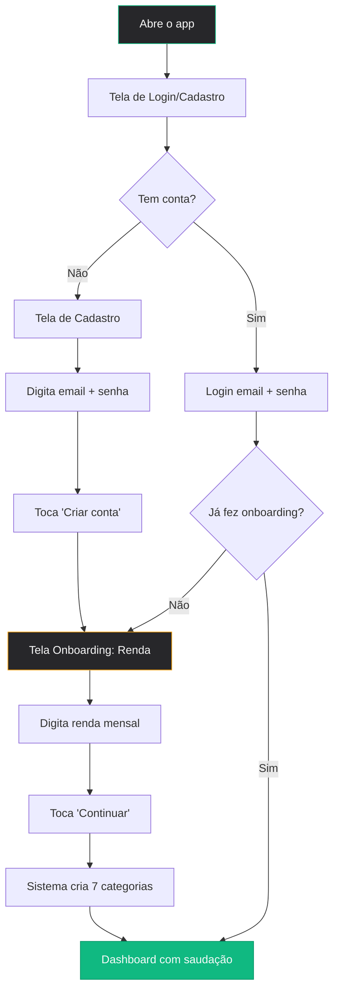
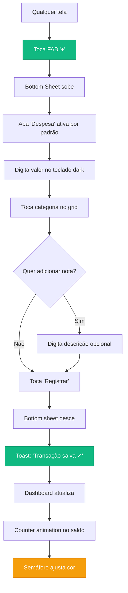
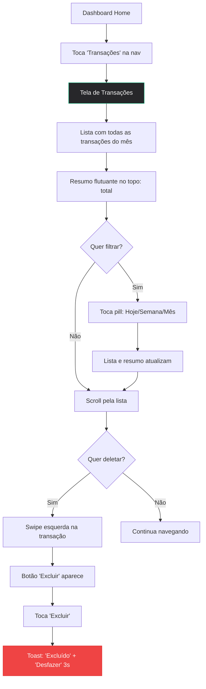
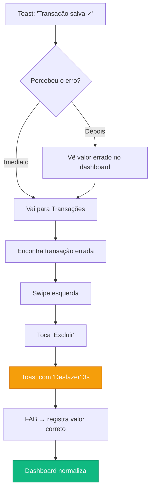

# UX Design Specification — MeuDinheiro

**Author:** Davidson
**Date:** 2026-03-19

---

## Executive Summary

### Project Vision

MeuDinheiro é um app web de finanças pessoais que resolve exatamente dois problemas com excelência: **visualizar para onde vai o dinheiro** (dashboard com semáforo emocional) e **registrar gastos sem fricção** (bottom sheet em 3 toques, < 10 segundos). O diferencial é emocional, não funcional — visual dark premium inspirado no PicPay (zinc-950, verde esmeralda #10b981), animações fluidas com Framer Motion e experiência mobile-first com zona do polegar respeitada. Escopo cirúrgico permite execução impecável em vez de features medianas.

**Contexto:** Projeto de portfólio apresentado em live — sucesso = impressionar visualmente + código limpo + funcionalidade completa sem erros.

**Stack:** Next.js + React + TypeScript + Tailwind CSS + shadcn/ui + Prisma/SQLite + Framer Motion + Sonner.

### Target Users

**Persona Primária 1 — Lucas, 24 anos ("O Jovem que Quer Sair do Vermelho")**
Dev júnior, primeiro emprego CLT, R$ 3.500/mês, mora sozinho. Vive no celular e exige visual bonito em tudo que usa. Já baixou Mobills, achou feio, deletou em 2 dias. Hoje controla nada. O que o faria ficar: abrir o app e pensar "isso é bonito demais", registrar o almoço em 3 toques, ver o semáforo de cores mudar. Prazer visual = hábito.

**Persona Primária 2 — Camila, 31 anos ("A Mãe que Quer Controle Rápido")**
RH, casada, 1 filho. Renda familiar R$ 7.000. Tempo livre zero. Usa bloco de notas pra anotar gastos, esquece metade. O que a faria ficar: registrar o supermercado enquanto espera na fila (FAB → bottom sheet → 5 segundos), mostrar pro marido o dashboard com números reais no fim do mês.

**Persona Secundária — Audiência da Live**
Espectadores que julgam pelo visual antes do código. Precisam ver animações fluidas, visual premium e fluxo completo sem erros em poucos minutos de demo.

### Key Design Challenges

1. **Registro ultra-rápido vs completude** — O bottom sheet precisa ser extremamente rápido (< 10s) sem sacrificar a possibilidade de adicionar detalhes (descrição opcional, categoria correta). O design deve priorizar o caminho feliz (valor + categoria) e tornar o resto acessível mas não obrigatório.

2. **Dark mode com acessibilidade** — Manter contraste WCAG AA (>= 4.5:1 texto, >= 3:1 elementos grandes) num tema escuro premium sem parecer "apagado". O verde esmeralda #10b981 sobre zinc-950 precisa ser validado em todos os contextos de uso.

3. **Zona do polegar em telas variadas** — FAB, bottom sheet, categorias e navegação devem ser alcançáveis com uma mão em telas de 5" a 6.7". Tudo crítico na metade inferior, touch targets mínimo 48px.

4. **Coreografia de animações** — Counter animation, fade+slide, skeleton loading precisam funcionar a 60fps sem jank, especialmente em dispositivos mobile mid-range. Respeitar `prefers-reduced-motion`.

### Design Opportunities

1. **Feedback emocional como motor de retenção** — O semáforo de cores no saldo (verde/amarelo/vermelho) + counter animation cria um loop emocional que transforma a checagem diária em hábito. O usuário "sente" sua saúde financeira antes de ler números.

2. **Momento "wow" coreografado para live** — A sequência skeleton → counter → slide-in pode ser desenhada como uma coreografia visual que impressiona em segundos. Cada transição reforça a sensação de app premium.

3. **Simplicidade radical como diferencial** — O escopo cirúrgico (dashboard + registro + auth) permite que cada micro-interação seja polida ao extremo — algo impossível em apps com dezenas de features. Menos telas = mais qualidade por tela.

4. **Bottom sheet como experiência signature** — O registro via bottom sheet pode se tornar a interação mais memorável do app. Animação suave subindo do polegar, teclado dark integrado, categorias coloridas em grid — cada detalhe reforça a identidade.

---

## Core User Experience

### Defining Experience

**"Toque, registre, entenda."** — A experiência signature do MeuDinheiro pode ser descrita em uma frase: "Registrar um gasto em 3 toques e ver instantaneamente o impacto no seu mês." É a combinação de velocidade de registro (bottom sheet) + feedback visual imediato (dashboard atualizado com semáforo) que cria o loop de valor.

Comparando com apps famosos:
- Tinder: "Swipe para dar match"
- MeuDinheiro: **"FAB → valor → categoria → pronto. Dashboard mostra tudo."**

O core loop é: **Gastar → Registrar (3 toques) → Ver impacto (dashboard) → Sentir (semáforo) → Repetir**.

### Platform Strategy

| Aspecto | Decisão | Justificativa |
|---------|---------|---------------|
| **Plataforma primária** | Web mobile (touch) | Público-alvo vive no celular |
| **Plataforma secundária** | Web desktop | Demo na live e desenvolvimento |
| **Abordagem** | Mobile-first | Touch-first, breakpoints para desktop |
| **Navegação** | Bottom tab bar (3 abas) | Padrão mobile, zona do polegar |
| **Offline** | Não no MVP | Simplifica arquitetura, foco em funcionalidade |
| **Input primário** | Touch (polegar) | FAB e bottom sheet otimizados para uma mão |

### Effortless Interactions

1. **Registro de transação** — FAB sempre visível → bottom sheet sobe do polegar → teclado numérico dark → toque em categoria colorida → toast confirma. Zero navegação, zero pensamento, zero digitação de texto obrigatória.

2. **Compreensão do dashboard** — Abrir o app e em < 2 segundos saber: quanto tem (hero card), como está (semáforo verde/amarelo/vermelho), onde gastou (últimas transações). Informação hierárquica — o mais importante é o maior e mais visível.

3. **Correção de erros** — Swipe para esquerda na transação → deletar → toast com "Desfazer" por 3s. Sem modal de confirmação, sem tela de edição. Rápido e reversível.

4. **Onboarding** — Email + senha → renda mensal → dashboard com categorias prontas. < 30 segundos, sem tutorial, sem tour.

### Critical Success Moments

| Momento | Critério | Emoção Alvo |
|---------|----------|-------------|
| **Primeiro registro** | < 10 segundos, zero confusão | "Isso foi rápido!" |
| **Dashboard pela primeira vez** | Entender tudo em < 2s | "É bonito e faz sentido" |
| **Semáforo muda de cor** | Feedback visual imediato ao registrar | "Uau, reage em tempo real" |
| **Fim do mês** | Ver resumo real por categoria | "Agora eu sei pra onde vai" |
| **Demo na live** | Skeleton → counter → slide-in | "Parece app de verdade" |

### Experience Principles

1. **Velocidade acima de completude** — Cada interação deve ser rápida primeiro, completa depois. O caminho feliz é sempre o mais curto. Detalhes opcionais ficam acessíveis mas nunca obrigatórios.

2. **Feedback emocional, não informativo** — O semáforo de cores comunica mais que números. Verde = tranquilo, amarelo = atenção, vermelho = perigo. O usuário sente antes de ler.

3. **Uma mão, um polegar** — Tudo acessível na zona do polegar. FAB no canto inferior direito, bottom sheet sobe de baixo, categorias em grid na metade inferior, bottom nav acessível.

4. **Visual que recompensa** — Cada interação tem feedback visual: counter animation nos valores, fade+slide nos cards, toast nas ações, skeleton no carregamento. O app "reage" a tudo que o usuário faz.

5. **Escopo é feature** — Fazer pouco e fazer perfeito. Cada tela é polida ao extremo porque não há dezenas competindo por atenção.

---

## Desired Emotional Response

### Primary Emotional Goals

| Emoção | Descrição | Momento |
|--------|-----------|---------|
| **Orgulho** | "Esse app é bonito demais, quero mostrar pros amigos" | Ao abrir o app, ver o visual dark premium |
| **Controle** | "Agora eu sei exatamente pra onde vai meu dinheiro" | Ao ver o dashboard com resumo real |
| **Satisfação** | "Registrei em 3 segundos, nem senti" | Ao completar registro no bottom sheet |
| **Confiança** | "O semáforo não mente — sei como estou" | Ao ver a cor do saldo mudar |

### Emotional Journey Mapping

```
Descoberta → "Que bonito!" (Fascínio)
    ↓
Onboarding → "Foi rápido" (Alívio)
    ↓
Primeiro Registro → "Isso foi fácil!" (Surpresa positiva)
    ↓
Dashboard → "Entendi tudo" (Clareza)
    ↓
Semáforo muda → "Reage em tempo real!" (Encantamento)
    ↓
Fim do mês → "Agora eu sei" (Empoderamento)
    ↓
Uso diário → "Meu termômetro financeiro" (Hábito + Controle)
    ↓
Mostra pra alguém → "Olha que app bonito" (Orgulho)
```

**Em caso de erro:**
```
Errou valor → "Epa" (Preocupação leve)
    ↓
Swipe delete → "Fácil corrigir" (Alívio)
    ↓
Toast "Desfazer" → "Tem volta" (Segurança)
    ↓
Re-registro → "Resolvido" (Confiança restaurada)
```

### Micro-Emotions

| Micro-emoção | Contexto | Design Response |
|--------------|----------|-----------------|
| **Confiança vs Confusão** | Dashboard deve ser claro sem instrução | Hierarquia visual forte — saldo grande, semáforo óbvio, labels claros |
| **Velocidade vs Ansiedade** | Registro não pode parecer apressado | Bottom sheet com animação suave (não abrupta), confirmação visual clara |
| **Controle vs Sobrecarga** | Dados financeiros podem assustar | Semáforo simplifica (3 cores), últimas 5 transações (não todas), filtros simples |
| **Prazer vs Tédio** | App de finanças não pode parecer planilha | Counter animation, fade+slide, categorias coloridas, dark mode premium |
| **Segurança vs Medo** | Deletar transação precisa de safety net | Toast com "Desfazer" 3s — sem modal bloqueante, mas com reversibilidade |

### Design Implications

| Emoção Alvo | Decisão de Design |
|-------------|-------------------|
| Orgulho → | Dark mode zinc-950, verde esmeralda #10b981, cards com profundidade, animações fluidas |
| Controle → | Hero card com saldo + semáforo, resumo receita vs despesa, últimas transações na home |
| Satisfação → | Bottom sheet rápido, teclado numérico, categorias em grid, toast de confirmação |
| Confiança → | Semáforo reage em tempo real, counter animation mostra valor "contando", dados persistem |
| Segurança → | Swipe delete + toast undo, olho para ocultar valores, sessão autenticada |

### Emotional Design Principles

1. **Beleza gera hábito** — Se o app é feio, ninguém abre. Se é bonito, abrem todo dia "só pra ver". O visual premium é estratégia de retenção, não vaidade.

2. **Feedback emocional > feedback informativo** — Uma cor verde no saldo comunica "tá tudo bem" mais rápido que "Saldo: R$ 1.350,00 (positivo)". Cores e animações são a primeira camada de informação.

3. **Fricção zero na ação core** — Todo pixel de distância entre "quero registrar" e "registrei" é inimigo. FAB sempre visível, bottom sheet sem navegação, categorias sem busca.

4. **Recovery sem drama** — Erros acontecem. A resposta emocional deve ser "fácil corrigir" e nunca "o que eu fiz?!". Swipe + toast + 3 segundos = resolvido.

---

## UX Pattern Analysis & Inspiration

### Inspiring Products Analysis

**1. PicPay — Referência Visual Principal**
- **O que faz bem:** Dark mode premium com verde como destaque, cards com profundidade, tipografia hierárquica, transições suaves entre telas
- **Padrões transferíveis:** Paleta zinc + verde esmeralda, cards arredondados (rounded-2xl), bottom nav com dot ativo, hero card no topo
- **O que evitar:** Excesso de banners promocionais, complexidade de features financeiras

**2. Nubank — Referência de Simplicidade**
- **O que faz bem:** Informação hierárquica clara (saldo grande, transações abaixo), carregamento com skeleton, animações sutis nos valores
- **Padrões transferíveis:** Skeleton loading nos cards, counter animation no saldo, lista de transações com ícone + valor
- **O que evitar:** Purple branding genérico, telas de "educação financeira" que ninguém lê

**3. Duolingo — Referência de Engajamento**
- **O que faz bem:** Feedback imediato em cada ação (som, cor, animação), gamification que cria hábito, cores vivas que recompensam
- **Padrões transferíveis:** Toast de confirmação em cada ação, semáforo de cores como "streak" emocional, sensação de progresso
- **O que evitar:** Gamification excessiva (sem streaks, XP, leaderboard no MVP)

**4. Instagram Stories — Referência de Gestos**
- **O que faz bem:** Interações por gestos naturais (swipe, tap), transições fluidas, bottom sheet para ações secundárias
- **Padrões transferíveis:** Bottom sheet para registro (sobe do polegar), swipe para ações em lista, feedback tátil em cada toque
- **O que evitar:** Complexidade de gestos ocultos, dependency em tutoriais de gestos

### Transferable UX Patterns

**Navigation Patterns:**
- Bottom tab bar com 3 abas + dot verde ativo (inspirado PicPay)
- FAB "+" centralizado ou no canto inferior direito, sempre visível
- Bottom sheet modal para ações de criação (inspirado Instagram/Google Maps)

**Interaction Patterns:**
- Counter animation nos valores monetários (inspirado Nubank)
- Swipe-to-delete em listas com toast undo (padrão iOS/Android nativo)
- Grid de categorias coloridas para seleção rápida (inspirado apps de despesas japoneses)
- Teclado numérico customizado dark (inspirado calculadoras premium)

**Visual Patterns:**
- Dark mode como padrão com toggle para light (inspirado PicPay/Spotify)
- Cards arredondados com profundidade sutil (zinc-800 sobre zinc-950)
- Skeleton loading com pulso durante carregamento (inspirado Nubank/Facebook)
- Saudação personalizada no header ("Olá, Davidson")

**Feedback Patterns:**
- Toast com Sonner para cada ação completada (inspirado Material Design)
- Semáforo de cores no hero card (verde/amarelo/vermelho) — padrão universal
- Animação de fade+slide em cards ao carregar (inspirado apps bancários)

### Anti-Patterns to Avoid

1. **Planilha glorificada** — Apps como Mobills/Organizze que parecem tabelas com bordas. MeuDinheiro deve parecer app de lifestyle, não ferramenta contábil.

2. **Onboarding tutorial longo** — Nenhum tour de "clique aqui, depois ali". Se o app precisa de tutorial, o design falhou. Tudo deve ser auto-explicativo.

3. **Modal de confirmação para tudo** — "Tem certeza que deseja deletar?" bloqueia o fluxo. Toast com "Desfazer" por 3s é recovery sem fricção.

4. **Dropdown para categorias** — Dropdown oculta as opções e exige 2 toques. Grid visual com ícones coloridos é 1 toque e mais intuitivo.

5. **Teclado do sistema para valores** — O teclado padrão do celular mostra letras, autocorrect e é feio. Teclado numérico customizado dark é mais rápido e integrado ao visual.

6. **Gráficos complexos no MVP** — Donut charts, line charts, pie charts criam complexidade visual. Mini barras horizontais (receita vs despesa) comunicam o essencial sem poluir.

### Design Inspiration Strategy

**Adotar diretamente:**
- Dark mode zinc-950 + verde esmeralda #10b981 (PicPay)
- Bottom tab bar com dot ativo (PicPay)
- Skeleton loading (Nubank)
- Toast feedback em todas as ações (Material Design)
- Counter animation nos valores (Nubank)

**Adaptar para o contexto:**
- Bottom sheet do Instagram → customizado com abas Despesa/Receita + teclado numérico integrado
- Grid de categorias → versão simplificada com 7 categorias fixas + ícones coloridos
- Semáforo de cores → aplicado ao hero card do saldo (não existe assim em outros apps de finanças)

**Evitar completamente:**
- Estética de planilha/formulário (Mobills, Organizze)
- Gamification no MVP (streaks, XP, leaderboard)
- Modals bloqueantes para confirmação
- Gráficos complexos no MVP

---

## Design System Foundation

### Design System Choice

**Escolha: shadcn/ui (Themeable System)** — sistema de componentes headless baseado em Radix UI, customizável com Tailwind CSS.

### Rationale for Selection

| Critério | shadcn/ui | Motivo |
|----------|-----------|--------|
| **Customização** | Total — componentes são copiados para o projeto | Permite visual dark premium sem lutar contra o framework |
| **Acessibilidade** | Radix UI built-in (ARIA, keyboard nav, focus management) | WCAG AA garantido nos componentes base |
| **Performance** | Zero runtime CSS-in-JS, Tailwind apenas | Bundle < 200KB viável |
| **DX** | Copy-paste, sem dependência de versão | 1 dev (Davidson) consegue manter sem overhead |
| **Visual** | New York style já instalado | Base sofisticada para o visual premium |
| **Já instalado** | Sim (style: new-york, baseColor: neutral, cssVariables: true) | Zero setup adicional |

### Implementation Approach

1. **Base:** shadcn/ui components com estilo New York (já configurado)
2. **Tema:** CSS variables customizadas para dark mode zinc-950 + verde esmeralda
3. **Extensão:** Componentes custom (FAB, Bottom Sheet, Teclado Numérico) construídos com Radix + Tailwind + Framer Motion
4. **Tokens:** Design tokens via CSS custom properties em `globals.css`

### Customization Strategy

**Componentes shadcn/ui que serão usados (as-is ou customizados):**

| Componente | Uso | Customização |
|-----------|-----|-------------|
| `Button` | Ações, FAB base | Variante FAB (circular, verde, sombra) |
| `Card` | Hero card, transações | Dark (zinc-800), rounded-2xl, sombra sutil |
| `Dialog/Sheet` | Bottom sheet | Snap points, drag handle, animação suave |
| `Input` | Campos de formulário | Dark style, borda zinc-700 |
| `Tabs` | Despesa/Receita no bottom sheet | Verde ativo, transparente inativo |
| `Toast (Sonner)` | Feedback de ações | Dark style, ícone verde de sucesso |
| `Avatar` | Iniciais do perfil | Círculo verde + texto branco |
| `Skeleton` | Loading states | Pulso zinc-700/zinc-800 |
| `Badge` | Categorias, filtros | Variante colorida por categoria |

**Componentes 100% custom:**
- FAB (Floating Action Button)
- Bottom Sheet de Registro com teclado numérico
- Grid de Categorias Coloridas
- Hero Card de Saldo com semáforo
- Bottom Navigation Bar
- Counter Animation wrapper

---

## 2. Core User Experience

### 2.1 Defining Experience

**"FAB → Bottom Sheet → Registrou. Dashboard mostra o impacto."**

A interação que define o MeuDinheiro é o **registro instantâneo via bottom sheet com feedback visual no dashboard**. Se essa interação for rápida, fluida e satisfatória, o app vence. Se travar, confundir ou demorar — perdemos o usuário.

O que o Lucas diria pro amigo: *"Mano, aperto um botão, digito o valor, toco na categoria e pronto. O app já mostra como tá meu mês."*

### 2.2 User Mental Model

**Como os usuários pensam hoje:**
- Lucas: "Preciso anotar isso em algum lugar" → abre bloco de notas → esquece
- Camila: "Preciso anotar isso rápido" → abre bloco de notas → anota bagunçado → perde

**Modelo mental esperado do MeuDinheiro:**
- "Gastei → Registro (rápido como anotar) → Vejo o impacto (instantâneo)"
- O app é um **bloco de notas inteligente**: anota rápido como texto mas organiza como planilha

**Expectativas que precisamos respeitar:**
- Categoria = toque visual (não dropdown, não digitação)
- Valor = teclado numérico (não QWERTY)
- Confirmação = visual (toast, não tela de sucesso)
- Impacto = imediato (dashboard atualiza sem refresh)

### 2.3 Success Criteria

| Critério | Target | Indicador |
|----------|--------|-----------|
| Tempo de registro completo | < 10 segundos | Timer: FAB → toast confirmação |
| Toques para registro mínimo | 3 toques | FAB → valor → categoria |
| Compreensão do dashboard | < 2 segundos | Usuário identifica saldo e maior gasto |
| Feedback de registro | Instantâneo | Toast aparece em < 300ms após confirmar |
| Dashboard atualiza | Imediato | Sem refresh manual necessário |
| Recuperação de erro | < 10 segundos | Swipe delete → re-registro |

### 2.4 Novel UX Patterns

**Padrões estabelecidos (familiar):**
- Bottom sheet para ações (Google Maps, Instagram)
- Swipe-to-delete em listas (iOS nativo)
- Bottom tab navigation (padrão mobile universal)
- Toast feedback (Material Design)
- Skeleton loading (Facebook, Nubank)

**Combinação inovadora:**
- **Semáforo de saldo** — Nenhum app de finanças usa cores de semáforo no hero card principal. É um padrão universal (verde = ok, amarelo = cuidado, vermelho = perigo) aplicado de forma nova ao contexto financeiro.
- **Teclado numérico integrado ao bottom sheet** — Em vez de usar o teclado do sistema, o bottom sheet tem seu próprio teclado dark estilizado. Elimina o "salto" de layout quando o teclado do sistema sobe.
- **Grid de categorias como seleção primária** — Em vez de dropdown ou lista, as 7 categorias são apresentadas como grid de ícones coloridos. Mais visual, mais rápido, mais memorável.

**Não requer educação do usuário** — Todos os padrões usam metáforas familiares (semáforo, calculadora, grid de apps). Zero curva de aprendizado.

### 2.5 Experience Mechanics

**1. Initiation — O FAB**
```
Estado: Usuário em qualquer tela do app
Trigger: Botão "+" flutuante, sempre visível no canto inferior direito
Visual: Círculo verde esmeralda 56px, ícone "+" branco, sombra sutil
Animação: Scale 0.95 → 1.0 ao pressionar (spring)
Resultado: Bottom sheet sobe com animação (300ms ease-out)
```

**2. Interaction — O Bottom Sheet**
```
Layout (de cima para baixo):
├── Drag handle (barra cinza no topo)
├── Abas: [Despesa] [Receita] (tab verde quando ativa)
├── Display de valor: R$ 0,00 (text-3xl, verde se receita, branco se despesa)
├── Teclado numérico (grid 3x4, botões zinc-800, texto branco)
│   ├── [1] [2] [3]
│   ├── [4] [5] [6]
│   ├── [7] [8] [9]
│   └── [,] [0] [⌫]
├── Grid de categorias (2 rows, scroll horizontal se necessário)
│   ├── 🍔 Alimentação (laranja)
│   ├── 🚗 Transporte (azul)
│   ├── 🏠 Moradia (roxo)
│   ├── 🎮 Lazer (rosa)
│   ├── 💊 Saúde (vermelho)
│   ├── 📚 Educação (cyan)
│   └── 📦 Outros (cinza)
├── Campo descrição: "Adicionar nota..." (opcional, cinza discreto)
└── Botão confirmar: [Registrar] (verde esmeralda, full-width, 48px height)

Zona do polegar: Teclado + categorias + botão confirmar = tudo na metade inferior
```

**3. Feedback — Confirmação**
```
Ação: Usuário toca "Registrar"
Sequência:
1. Botão pulsa (scale 0.95 → 1.0, 100ms)
2. Bottom sheet desce (300ms ease-in)
3. Toast Sonner aparece: "Transação salva ✓" (canto inferior, 3s)
4. Dashboard atualiza:
   - Hero card: counter animation recalcula saldo (500ms)
   - Semáforo: cor ajusta se necessário (crossfade 300ms)
   - Últimas transações: nova transação aparece no topo (slide-in 200ms)
```

**4. Completion — O Loop**
```
Estado final: Usuário de volta na tela onde estava
Resultado visível: Toast confirmando + dashboard atualizado
Próxima ação natural: Ver o impacto no dashboard OU registrar outra transação
Loop: O dashboard atualizado motiva o próximo registro ("será que vou ficar no verde?")
```

---

## Visual Design Foundation

### Color System

**Paleta Principal — Dark Mode (Padrão)**

| Token | Valor | Uso |
|-------|-------|-----|
| `--background` | `#09090b` (zinc-950) | Fundo principal do app |
| `--card` | `#27272a` (zinc-800) | Fundo de cards e superfícies elevadas |
| `--card-hover` | `#3f3f46` (zinc-700) | Hover/press em cards interativos |
| `--border` | `#3f3f46` (zinc-700) | Bordas sutis |
| `--muted` | `#52525b` (zinc-600) | Texto secundário, placeholders |
| `--foreground` | `#fafafa` (zinc-50) | Texto principal |
| `--primary` | `#10b981` (emerald-500) | Cor de destaque — botões, ícones ativos, valores positivos |
| `--primary-hover` | `#059669` (emerald-600) | Hover em elementos primários |
| `--destructive` | `#ef4444` (red-500) | Valores negativos, erros, delete |
| `--warning` | `#f59e0b` (amber-500) | Semáforo amarelo, alertas |
| `--success` | `#10b981` (emerald-500) | Semáforo verde, confirmações |

**Semáforo de Saldo:**

| Estado | Cor | Condição | Significado |
|--------|-----|----------|-------------|
| Verde | `#10b981` | Saldo > 40% da renda | "Tá tranquilo" |
| Amarelo | `#f59e0b` | Saldo entre 10-40% da renda | "Atenção" |
| Vermelho | `#ef4444` | Saldo < 10% da renda | "Perigo" |

**Categorias — Cores Individuais:**

| Categoria | Cor | Ícone |
|-----------|-----|-------|
| Alimentação | `#f97316` (orange-500) | 🍔 |
| Transporte | `#3b82f6` (blue-500) | 🚗 |
| Moradia | `#8b5cf6` (violet-500) | 🏠 |
| Lazer | `#ec4899` (pink-500) | 🎮 |
| Saúde | `#ef4444` (red-500) | 💊 |
| Educação | `#06b6d4` (cyan-500) | 📚 |
| Outros | `#6b7280` (gray-500) | 📦 |

**Paleta Light Mode (Toggle)**

| Token | Valor |
|-------|-------|
| `--background` | `#ffffff` (white) |
| `--card` | `#f4f4f5` (zinc-100) |
| `--border` | `#e4e4e7` (zinc-200) |
| `--foreground` | `#09090b` (zinc-950) |
| `--primary` | `#059669` (emerald-600) — levemente mais escuro para contraste em fundo claro |

**Contraste WCAG AA Validado:**

| Combinação | Ratio | Status |
|-----------|-------|--------|
| zinc-50 sobre zinc-950 | 19.6:1 | AAA |
| emerald-500 sobre zinc-950 | 8.2:1 | AAA |
| zinc-400 (muted text) sobre zinc-950 | 5.5:1 | AA |
| amber-500 sobre zinc-950 | 9.1:1 | AAA |
| red-500 sobre zinc-950 | 5.4:1 | AA |

### Typography System

**Font Stack:**
- **Primária:** `Inter` (UI, labels, valores) — clean, moderno, boa legibilidade em telas
- **Fallback:** `system-ui, -apple-system, sans-serif`

**Type Scale (Mobile-first):**

| Token | Size | Weight | Line Height | Uso |
|-------|------|--------|-------------|-----|
| `display` | 2.25rem (36px) | 700 (bold) | 1.1 | Saldo no hero card |
| `h1` | 1.5rem (24px) | 700 (bold) | 1.2 | Títulos de seção |
| `h2` | 1.25rem (20px) | 600 (semi-bold) | 1.3 | Subtítulos |
| `h3` | 1.125rem (18px) | 600 (semi-bold) | 1.3 | Labels de card |
| `body` | 1rem (16px) | 400 (regular) | 1.5 | Texto geral |
| `body-sm` | 0.875rem (14px) | 400 (regular) | 1.5 | Texto secundário, datas |
| `caption` | 0.75rem (12px) | 500 (medium) | 1.4 | Labels pequenos, badges |
| `number` | 1rem-2.25rem | 600-700 | 1.1 | Valores monetários (variável) |

**Regras tipográficas:**
- Valores monetários sempre em `font-variant-numeric: tabular-nums` (alinhamento de números)
- Saldo com `tracking-tight` (-0.025em) para impacto visual
- Texto secundário em `zinc-400` (muted), nunca em opacidade reduzida (acessibilidade)

### Spacing & Layout Foundation

**Spacing Scale (base 4px):**

| Token | Valor | Uso |
|-------|-------|-----|
| `xs` | 4px | Espaço mínimo entre elementos inline |
| `sm` | 8px | Padding interno de badges, gap entre ícone e texto |
| `md` | 12px | Gap entre itens de lista |
| `base` | 16px | Padding de cards, gap entre seções pequenas |
| `lg` | 20px | Margin entre cards |
| `xl` | 24px | Padding horizontal do container |
| `2xl` | 32px | Gap entre seções principais |
| `3xl` | 48px | Espaço antes/depois de grupos maiores |

**Layout Principles:**
- **Container:** max-width 428px (mobile), centralizado no desktop com padding lateral
- **Grid:** Coluna única no mobile, grid 2-3 colunas no desktop (md: breakpoint)
- **Cards:** `rounded-2xl` (16px), padding `base` (16px), gap `lg` (20px) entre cards
- **Touch targets:** Mínimo 48x48px em todos os elementos interativos
- **Safe areas:** Respeitar `env(safe-area-inset-bottom)` para bottom nav em iOS

**Layout Structure (Mobile):**
```
┌─────────────────────────────┐
│ Header (saudação + olho)    │ ← padding-x: xl (24px)
│                             │
│ Hero Card (saldo)           │ ← margin-bottom: lg (20px)
│                             │
│ Ações Rápidas (row)         │ ← margin-bottom: lg (20px)
│                             │
│ Resumo Mensal (card)        │ ← margin-bottom: lg (20px)
│                             │
│ Últimas Transações (list)   │ ← padding-bottom: 3xl (48px) + nav height
│                             │
│ ─────────────────────────── │
│ Bottom Nav (fixed)          │ ← height: 64px + safe-area
│ [Home]  [FAB+]  [Perfil]   │
└─────────────────────────────┘
```

### Accessibility Considerations

**Contraste:** Todas as combinações de cor validadas para WCAG AA (>= 4.5:1 texto, >= 3:1 elementos grandes). Verde esmeralda #10b981 sobre zinc-950 = 8.2:1.

**Reduced Motion:** Toda animação envolvida em `prefers-reduced-motion` media query. Com reduced motion ativado: counter animation instantânea, fade+slide vira corte direto, skeleton sem pulso.

**Screen Reader:**
- Hero card: "Saldo atual: R$ 1.350,00. Status: apertado" (não "amarelo")
- Transação: "Alimentação, menos quarenta e cinco reais, hoje às quatorze e trinta"
- FAB: "Adicionar nova transação"
- Semáforo: `aria-label` descritivo, não depender só da cor

**Keyboard Navigation:**
- Tab order lógico: Header → Hero Card → Ações → Resumo → Transações → Nav
- Bottom sheet: Focus trap quando aberto, Escape para fechar
- Visible focus ring em todos os interativos (outline emerald-500, 2px offset)

**Touch:**
- Todos os targets >= 48x48px
- FAB: 56x56px (acima do mínimo)
- Categorias no grid: 64x64px
- Espaçamento entre targets: mínimo 8px

---

## Design Direction Decision

### Design Directions Explored

Para o MeuDinheiro, a direção visual é fortemente definida pelos documentos de entrada (Product Brief e Brainstorming). A referência PicPay + dark premium foi validada desde o brainstorming. Exploramos variações dentro desse conceito:

| Direção | Conceito | Foco |
|---------|----------|------|
| **A — Dark Minimal** | Zinc-950 puro, verde apenas em CTAs, espaço negativo generoso | Elegância, respiração |
| **B — Dark Rich** | Zinc-950 + cards zinc-800 com profundidade, verde em múltiplos pontos, gradientes sutis | Premium, sofisticação |
| **C — Dark Vibrant** | Zinc-950 + cores de categoria vibrantes, verde dominante, animações expressivas | Energia, juventude |

### Chosen Direction

**Direção B — Dark Rich** com elementos da C para categorias.

O MeuDinheiro segue a estética "dark rich" — fundo zinc-950 profundo com cards zinc-800 que criam camadas de profundidade. O verde esmeralda #10b981 aparece estrategicamente em CTAs, valores positivos, dot ativo da nav e FAB. As categorias usam cores vibrantes da Direção C para contraste e memorabilidade.

**Elementos chave:**
- Fundo: zinc-950 (profundo, não preto puro)
- Cards: zinc-800 com `rounded-2xl` e sombra `shadow-lg` sutil
- Profundidade: 3 camadas — fundo → card → card hover/pressed
- Verde esmeralda: estratégico, não dominante (FAB, valores positivos, nav ativa, botões primários)
- Categorias: cores vibrantes individuais sobre círculos zinc-700
- Tipografia: branca (zinc-50) com hierarquia clara (display → body → caption)

### Design Rationale

1. **"Dark Rich" suporta a emoção de premium** — Camadas de profundidade comunicam sofisticação sem esforço. O usuário percebe qualidade antes de interagir.
2. **Verde estratégico cria foco** — Em vez de verde em tudo, ele aparece onde a atenção é necessária: FAB (ação), saldo positivo (recompensa), nav ativa (localização).
3. **Categorias vibrantes quebram a monotonia** — Num app predominantemente escuro, os ícones coloridos das categorias são âncoras visuais que ajudam na memorização e na velocidade de seleção.
4. **Alinhamento com referência PicPay** — A Direção B é a mais próxima da estética PicPay que foi definida como referência desde o brainstorming.

### Implementation Approach

1. **CSS Variables** em `globals.css` com tema dark como padrão e light como override via `.light` class
2. **Tailwind config** extendido com tokens customizados (emerald-500 como primary, zinc scale como neutrals)
3. **shadcn/ui theme** customizado via CSS variables (já suporta dark/light toggle nativo)
4. **Framer Motion** para transições entre camadas (spring animation para profundidade)
5. **Sombras customizadas** para criar profundidade em dark mode (shadow com opacidade, não preto)

---

## User Journey Flows

### Journey 1: Onboarding — "Do Zero ao Dashboard" (Happy Path)

**Entry:** Usuário abre o app pela primeira vez



**Tempo total:** < 30 segundos (cadastro + renda → dashboard)
**Toques:** ~8 (email, senha, criar conta, valor renda, continuar)
**Momento de valor:** Ver "Olá, Davidson" + dashboard vazio mas bonito com skeleton que some

### Journey 2: Registro de Transação — "FAB → Pronto" (Core Loop)

**Entry:** Usuário em qualquer tela, quer registrar um gasto



**Tempo total (caminho mínimo):** < 10 segundos (FAB → valor → categoria → registrar)
**Toques mínimos:** 3 (FAB → categoria → registrar) + digitação do valor
**Feedback:** Toast instantâneo + dashboard reativo

### Journey 3: Consulta e Filtro — "Onde Foi Meu Dinheiro?" (Secondary Loop)

**Entry:** Usuário quer ver histórico de gastos



### Journey 4: Error Recovery — "Digitei Errado" (Edge Case)

**Entry:** Usuário registrou valor errado



**Tempo de recovery:** < 15 segundos (encontrar → deletar → re-registrar)

### Journey Patterns

**Padrões recorrentes identificados nos fluxos:**

| Padrão | Onde Aparece | Implementação |
|--------|-------------|---------------|
| **Entry via bottom nav** | Todas as navegações entre telas | 3 abas fixas, dot verde ativo, transição fade |
| **FAB como atalho universal** | Registro de qualquer tela | Floating, sempre visível, z-index alto |
| **Toast como feedback** | Registro, deleção, undo | Sonner, posição inferior, 3s duração |
| **Swipe como ação destrutiva** | Deleção de transações | Esquerda = vermelho/excluir, com undo |
| **Counter como atualização** | Saldo após registro/deleção | 500ms, spring easing |
| **Skeleton → conteúdo** | Carregamento de todas as telas | Pulso zinc-700, substitui por fade |

### Flow Optimization Principles

1. **Mínimo de toques para valor** — O registro de transação é o fluxo mais crítico. 3 toques + digitação = mínimo possível sem sacrificar clareza.
2. **Feedback em camadas** — Cada ação gera feedback visual (toast) + feedback contextual (dashboard atualiza). O usuário nunca fica sem saber se funcionou.
3. **Recovery sem punição** — Erros são corrigidos com swipe + re-registro, não com formulários de edição. Deletar e refazer é mais rápido que editar.
4. **Progressive disclosure** — Dashboard mostra últimas 5 transações (não todas). Tela de transações mostra o histórico completo. Descrição é opcional. Detalhes quando o usuário quer, não quando o app impõe.

---

## Component Strategy

### Design System Components

**shadcn/ui Components — Usados Diretamente:**

| Componente | Uso no MeuDinheiro | Customização Necessária |
|-----------|-------------------|------------------------|
| `Button` | Botões de ação (Criar conta, Registrar, Continuar) | Variantes: primary (verde), ghost, destructive (vermelho) |
| `Card` | Hero card, resumo mensal, transações | Background zinc-800, rounded-2xl, shadow-lg |
| `Input` | Email, senha, renda, descrição | Border zinc-700, focus ring emerald-500 |
| `Label` | Labels de formulário | Cor zinc-400, size body-sm |
| `Tabs` | Despesa/Receita no bottom sheet | Active: verde + underline, inactive: zinc-400 |
| `Avatar` | Iniciais do perfil | Background emerald-500, texto branco |
| `Badge` | Filtro pills (Hoje/Semana/Mês) | Active: emerald-500 bg, inactive: zinc-800 |
| `Separator` | Divisor entre seções | Cor zinc-800 |
| `Skeleton` | Loading de cards e listas | Pulso zinc-700 → zinc-800 |
| `Switch` | Toggle dark/light mode | Track zinc-700, thumb emerald-500 |

**Sonner (Toast) — Já Instalado:**
- Posição: bottom-center
- Estilo: dark (zinc-800 bg, zinc-50 text)
- Ícone de sucesso: checkmark emerald-500
- Duração: 3s
- Ação: "Desfazer" em toasts de deleção

### Custom Components

**1. FloatingActionButton (FAB)**
```
Propósito: Iniciar registro de transação de qualquer tela
Tamanho: 56x56px (acima do mínimo 48px)
Cor: emerald-500, ícone "+" branco
Posição: fixed, bottom-right, acima da bottom nav
Sombra: shadow-lg com emerald-500/20
Estados:
  - Default: emerald-500
  - Pressed: scale(0.95), emerald-600
  - Disabled: zinc-600 (durante bottom sheet aberto)
Acessibilidade: aria-label="Adicionar nova transação"
Animação: spring scale no press (Framer Motion)
Z-index: 50 (acima de tudo exceto bottom sheet)
```

**2. BottomSheet (Registro de Transação)**
```
Propósito: Registro rápido de despesa/receita
Tipo: Modal bottom sheet com drag handle
Altura: ~85% da tela (snap point)
Animação: slide-up 300ms ease-out (Framer Motion)
Backdrop: zinc-950/80 (blur sutil)
Estrutura interna:
  ├── DragHandle (barra zinc-600, 40x4px, rounded)
  ├── TabSwitch (Despesa | Receita)
  ├── ValueDisplay (R$ 0,00 → valor digitado)
  ├── NumericKeypad (grid 3x4)
  ├── CategoryGrid (grid 4x2, scroll se necessário)
  ├── DescriptionInput (opcional, collapsed por default)
  └── SubmitButton (full-width, emerald-500)
Fechamento: Drag down, backdrop tap, Escape key
Focus trap: Sim, quando aberto
Acessibilidade: role="dialog", aria-modal="true"
```

**3. NumericKeypad**
```
Propósito: Entrada de valores monetários sem teclado do sistema
Layout: Grid 3x4
  [1] [2] [3]
  [4] [5] [6]
  [7] [8] [9]
  [,] [0] [⌫]
Tamanho botões: 64x48px (touch-friendly)
Estilo: zinc-800 bg, zinc-50 text, rounded-xl
Feedback: scale(0.95) + zinc-700 bg no press
Backspace: ícone delete, long-press limpa tudo
Formatação: Auto-formata como moeda (R$ 1.234,56)
```

**4. CategoryGrid**
```
Propósito: Seleção visual de categoria
Layout: Grid responsivo (4 colunas mobile, wrap)
Item: Círculo 56x56px com ícone + label abaixo
  ├── Círculo: cor da categoria (opacity 20% bg + cor solid no ícone)
  ├── Ícone: emoji da categoria (24px)
  └── Label: nome da categoria (caption, zinc-400)
Estado selecionado: Ring emerald-500 (2px), scale(1.05)
Acessibilidade: role="radiogroup", cada item role="radio"
```

**5. HeroCard (Saldo)**
```
Propósito: Exibir saldo atual com feedback emocional (semáforo)
Layout:
  ├── Label: "Saldo atual" (body-sm, zinc-400)
  ├── Valor: R$ X.XXX,XX (display, bold, com counter animation)
  ├── Semáforo: borda left 4px com cor do status
  ├── Olho: toggle para ocultar valor (ícone eye/eye-off)
  └── Subinfo: "Receitas R$X | Despesas R$X" (caption)
Background: zinc-800 com borda-left da cor do semáforo
Counter: animate 0 → valor em 500ms (Framer Motion, spring)
Ocultar: valor vira "R$ ••••••" com fade transition
```

**6. BottomNavBar**
```
Propósito: Navegação principal entre 3 telas
Layout: Fixed bottom, 3 itens centralizados
Itens:
  ├── Home (ícone house)
  ├── Transações (ícone list)
  └── Perfil (ícone user)
Ativo: ícone emerald-500 + dot 4px emerald-500 abaixo
Inativo: ícone zinc-500
Tamanho: height 64px + safe-area-inset-bottom
Background: zinc-900 com border-top zinc-800
FAB position: O FAB fica ACIMA da nav, não dentro dela
```

**7. TransactionItem**
```
Propósito: Item individual na lista de transações
Layout: Row
  ├── Avatar categoria (círculo colorido 40x40px + ícone)
  ├── Info (coluna)
  │   ├── Nome da categoria (body, zinc-50)
  │   └── Descrição ou data (body-sm, zinc-400)
  └── Valor (body, bold, emerald-500 se receita, zinc-50 se despesa, com "- R$" prefix)
Swipe: Esquerda revela botão "Excluir" (red-500 bg)
Animação: slide-in ao aparecer (fade + translateY)
```

### Component Implementation Strategy

| Prioridade | Componentes | Justificativa |
|-----------|-------------|---------------|
| **P0 — Core Loop** | FAB, BottomSheet, NumericKeypad, CategoryGrid, HeroCard | Sem eles não há registro nem dashboard |
| **P1 — Navegação** | BottomNavBar, TransactionItem | Sem eles não há navegação nem histórico |
| **P2 — Polish** | Skeleton variants, Counter animation, Toast customization | Diferencial visual, mas app funciona sem |
| **P3 — Extras** | Toggle tema, Avatar perfil, Pills de filtro | Nice-to-have, usa shadcn/ui direto |

### Implementation Roadmap

**Fase 1 — Foundation (Auth + Layout Shell)**
- BottomNavBar (navegação funcional)
- Layout com header + scrollable content + fixed nav
- Configuração de tema (CSS variables, dark mode default)

**Fase 2 — Core Loop (Dashboard + Registro)**
- HeroCard com semáforo e counter animation
- FAB posicionado sobre a nav
- BottomSheet com tabs Despesa/Receita
- NumericKeypad funcional
- CategoryGrid com 7 categorias
- Toast de confirmação

**Fase 3 — Histórico (Transações)**
- TransactionItem com swipe-to-delete
- Lista filtrada por pills (Hoje/Semana/Mês)
- Resumo flutuante com total do período
- Toast com undo

**Fase 4 — Polish**
- Skeleton loading em todos os cards
- Counter animation refinada
- Transições entre telas (Framer Motion)
- Toggle dark/light mode
- Perfil com avatar de iniciais

---

## UX Consistency Patterns

### Button Hierarchy

| Nível | Estilo | Uso | Exemplo |
|-------|--------|-----|---------|
| **Primary** | bg emerald-500, text white, rounded-lg, h-12 | Ação principal da tela | "Criar conta", "Registrar", "Continuar" |
| **Secondary** | bg zinc-800, text zinc-50, border zinc-700, rounded-lg, h-12 | Ação alternativa | "Já tenho conta" |
| **Ghost** | bg transparent, text zinc-400, rounded-lg, h-10 | Ação terciária, links | "Esqueci a senha", "Ver todas" |
| **Destructive** | bg red-500, text white, rounded-lg, h-12 | Ação destrutiva | "Excluir" (no swipe) |
| **FAB** | bg emerald-500, rounded-full, w-14 h-14, shadow-lg | Ação global flutuante | "+" adicionar transação |

**Regras:**
- Máximo 1 botão primary por tela/contexto
- Primary sempre à direita ou centralizado full-width
- Todos os botões >= 48px de altura (touch target)
- Feedback de press: scale(0.97) + cor escurecida

### Feedback Patterns

| Tipo | Componente | Visual | Duração |
|------|-----------|--------|---------|
| **Sucesso** | Toast (Sonner) | "Transação salva ✓" — ícone verde | 3 segundos |
| **Desfazer** | Toast com action | "Excluído" + botão "Desfazer" | 3 segundos |
| **Erro** | Toast | "Erro ao salvar" — ícone vermelho | 5 segundos |
| **Loading** | Skeleton | Pulso zinc-700/zinc-800 nos formatos dos cards | Até carregar |
| **Valor atualizado** | Counter animation | Número conta de 0 ao valor (spring, 500ms) | 500ms |
| **Card novo** | Slide-in | fade + translateY(20px → 0) | 200ms |
| **Semáforo mudou** | Crossfade | Cor transita suavemente | 300ms |

**Regras:**
- Toda ação do usuário gera feedback visual em < 300ms
- Toasts nunca bloqueiam interação (são informativos)
- Skeleton aparece imediatamente (sem tela branca/vazia)
- Animações respeitam `prefers-reduced-motion`

### Form Patterns

| Elemento | Estilo | Comportamento |
|---------|--------|---------------|
| **Input** | bg zinc-800, border zinc-700, rounded-lg, h-12, px-4 | Focus: border emerald-500, ring emerald-500/20 |
| **Label** | text zinc-400, body-sm, acima do input | Sempre visível (não placeholder como label) |
| **Placeholder** | text zinc-600 | Desaparece ao focar |
| **Erro** | text red-400, body-sm, abaixo do input | Aparece após blur se inválido (zod) |
| **Senha** | Com toggle show/hide (ícone olho) | Ícone à direita do input |

**Regras:**
- Validação via `react-hook-form` + `zod` (client + server)
- Erro aparece após blur (não enquanto digita)
- Submit desabilitado enquanto form inválido (feedback visual)
- Todos os inputs com `autoComplete` apropriado

### Navigation Patterns

| Elemento | Comportamento |
|---------|---------------|
| **Bottom Nav** | Fixed bottom, 3 tabs, ícone + dot ativo (emerald-500) |
| **Navegação entre telas** | Client-side, sem reload. Fade transition (150ms) |
| **Back navigation** | Não necessário — bottom nav cobre todas as telas do MVP |
| **Bottom Sheet** | Modal overlay, não é navegação (não muda URL) |
| **Deep linking** | `/` (dashboard), `/transactions` (transações), `/profile` (perfil) |

**Regras:**
- Bottom nav sempre visível (exceto durante bottom sheet aberto)
- FAB visível em Home e Transações (não no Perfil)
- Tela ativa indicada por dot verde + ícone emerald-500
- Transições entre telas: fade out 100ms → fade in 150ms

### Additional Patterns

**Empty States:**

| Tela | Estado Vazio | CTA |
|------|-------------|-----|
| Dashboard (novo usuário) | Ilustração simples + "Registre sua primeira transação" | FAB pulsa suavemente |
| Transações (sem registros) | "Nenhuma transação encontrada" + ícone | "Adicionar" link |
| Filtro sem resultado | "Sem transações neste período" | Sugestão de outro filtro |

**Loading States:**
- Skeleton com formato exato do conteúdo final (hero card shape, transaction row shape)
- Pulso: zinc-700 → zinc-800 → zinc-700 (2s cycle)
- Transição skeleton → conteúdo: fade (200ms)

**Ocultar Valores:**
- Toggle olho no hero card
- Quando oculto: todos os valores viram "R$ ••••••"
- Estado persiste na sessão (não entre sessões)
- Afeta: saldo, receita/despesa resumo, valores de transações

---

## Responsive Design & Accessibility

### Responsive Strategy

**Mobile (< 768px) — Experiência Primária:**
- Coluna única, full-width
- Bottom nav fixa
- FAB no canto inferior direito
- Cards com padding 16px, gap 20px
- Teclado numérico otimizado para polegar
- Bottom sheet ocupa ~85% da altura da tela

**Tablet (768px - 1023px):**
- Coluna única mais larga (max-width 600px, centralizado)
- Mesma bottom nav e FAB
- Cards com padding maior (20px)
- Categorias no grid podem expandir para 4x2

**Desktop (>= 1024px) — Demo na Live:**
- Layout centralizado com max-width 428px (simula mobile)
- Background zinc-950 com o "app" centralizado
- Opcional: sidebar com transações expandidas (grid 2 colunas)
- FAB e bottom sheet funcionam igual (demonstração)
- Bottom nav visível para demonstrar o conceito mobile

### Breakpoint Strategy

| Breakpoint | Tailwind | Mudanças |
|-----------|----------|----------|
| `base` | 0-767px | Mobile-first, coluna única, touch otimizado |
| `md` | 768-1023px | Container max-width 600px, padding aumentado |
| `lg` | 1024px+ | Container max-width 428px centralizado OU layout expandido para demo |

**Abordagem: Mobile-first** — CSS base é mobile, `md:` e `lg:` adicionam adaptações.

### Accessibility Strategy

**Nível de Compliance: WCAG 2.1 AA**

| Requisito | Implementação |
|-----------|---------------|
| **Contraste de cor** | Todas as combinações >= 4.5:1 (texto) e >= 3:1 (elementos grandes) |
| **Keyboard nav** | Tab order lógico, visible focus ring (2px emerald-500), skip links |
| **Screen reader** | Semantic HTML (nav, main, section, h1-h3), aria-labels descritivos |
| **Touch targets** | Mínimo 48x48px, FAB 56x56px, espaçamento 8px entre targets |
| **Reduced motion** | `prefers-reduced-motion`: counter instantâneo, sem slide, sem pulso |
| **Focus management** | Focus trap no bottom sheet, restore focus ao fechar |
| **Color independence** | Semáforo usa cor + texto descritivo (aria-label), não depende só de cor |
| **Font scaling** | Rem units, layout não quebra até 200% zoom |

**Semantic HTML Structure:**
```html
<body>
  <header> <!-- saudação + olho -->
  <main>
    <section aria-label="Saldo"> <!-- hero card -->
    <section aria-label="Ações rápidas"> <!-- botões circulares -->
    <section aria-label="Resumo do mês"> <!-- barras receita/despesa -->
    <section aria-label="Últimas transações"> <!-- lista -->
  </main>
  <nav aria-label="Navegação principal"> <!-- bottom nav -->
  <div role="dialog" aria-modal="true"> <!-- bottom sheet quando aberto -->
</body>
```

### Testing Strategy

**Responsivo:**
- Chrome DevTools device simulation (iPhone SE, iPhone 14, Pixel 7)
- Teste em dispositivo real (iPhone/Android) via rede local
- Lighthouse mobile score >= 90

**Acessibilidade:**
- axe DevTools (automated scan) — zero violations
- Tab navigation manual em todas as telas
- VoiceOver (macOS/iOS) para fluxo completo: login → registro → dashboard
- Contraste validado com WebAIM Contrast Checker

**Animações:**
- Chrome DevTools Performance panel — verificar 60fps
- `prefers-reduced-motion` toggle — verificar fallbacks
- Dispositivo mid-range (teste de jank)

### Implementation Guidelines

**Responsivo:**
- Usar `rem` para fontes, `px` para bordas/sombras
- Tailwind classes mobile-first: `p-4 md:p-5 lg:p-6`
- Container: `mx-auto max-w-[428px] lg:max-w-[428px]` (simula mobile no desktop)
- Testar com zoom 200% (layout não pode quebrar)
- `env(safe-area-inset-bottom)` no bottom nav

**Acessibilidade:**
- Semantic tags em vez de `div` genéricos
- `aria-label` em todos os ícones sem texto visível
- `aria-live="polite"` no hero card (atualiza valor sem roubar foco)
- `role="radiogroup"` no CategoryGrid
- `focus-visible:ring-2 focus-visible:ring-emerald-500` em todos os interativos
- Nunca remover outline de focus (customizar, não remover)
